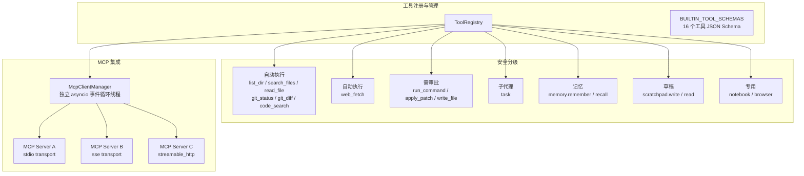
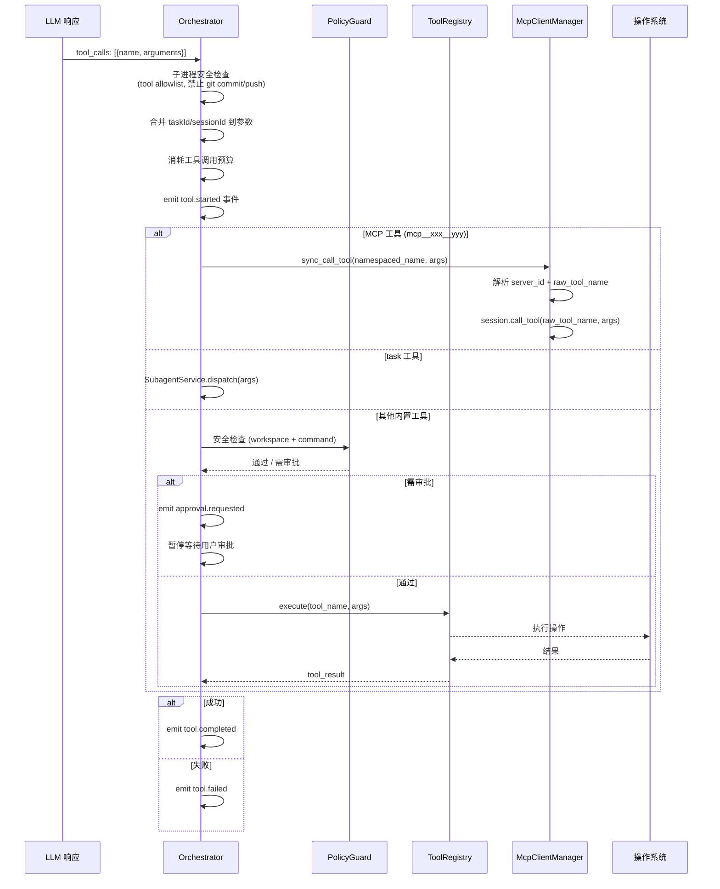

# 工具系统与 MCP 集成

## 工具系统架构

> 2026-05-20 status note: this document still contains visible mojibake and
> should be treated as a historical MCP/tool reference until the encoding cleanup
> task is completed. For current project status, test gates, and remediation
> priority, use `docs/YUANBAO_AGENT_DOCS_CONSOLIDATED.md`.
>
> Current MCP runtime status: MCP CRUD/refresh is wired through backend RPC,
> shared contracts, runtime client, UI, and desktop E2E. Desktop MCP live now
> passes create/list/update/enable/refresh/disable/delete after
> `de722aea Fix MCP partial update validation`. Advisor-requested MCP evidence
> tools pass through ToolPolicyResolver, MCP/skill policy, PermissionEngine, and
> explicit approval-resume execution.



## 内置工具清单 (16个)

| 工具名 | 安全级别 | 需审批 | 说明 |
|---|---|---|---|
| `list_dir` | 只读 | 否 | 列出目录内容 |
| `search_files` | 只读 | 否 | 按 glob 模式搜索文件 |
| `read_file` | 只读 | 否 | 读取文件内容（带缓存） |
| `git_status` | 只读 | 否 | 查看 git 状态 |
| `git_diff` | 只读 | 否 | 查看 git 差异 |
| `code_search` | 只读 | 否 | 代码语义搜索 |
| `web_fetch` | 网络 | 否 | HTTP 抓取网页内容 |
| `run_command` | 危险 | 是 | 执行 shell 命令 (PowerShell) |
| `apply_patch` | 危险 | 是 | 应用代码补丁（支持修复重试） |
| `write_file` | 危险 | 是 | 写入文件 |
| `task` | 编排 | 是 | 派生子代理执行子任务 |
| `memory.remember` | 安全 | 否 | 写入持久记忆 |
| `memory.recall` | 安全 | 否 | 召回相关记忆 |
| `scratchpad.write` | 安全 | 否 | 写入临时草稿 |
| `scratchpad.read` | 安全 | 否 | 读取临时草稿 |
| `notebook` | 专用 | 否 | Jupyter notebook 操作 |
| `browser` | 专用 | 否 | 浏览器操作 |

## 工具执行流程



## MCP 集成详情

### 连接管理
- `McpClientManager` 运行在**独立守护线程**，有自己的 asyncio 事件循环
- 连接生命周期：`connect → initialize → list_tools → 注册到 ToolRegistry`

### 命名空间
- MCP 工具注册为 `mcp__{server_id}__{tool_name}` 格式，避免命名冲突

### 传输方式
| 传输 | 说明 |
|---|---|
| stdio | 子进程 stdin/stdout 通信 |
| sse | Server-Sent Events |
| streamable_http | HTTP 流式连接 |

### 同步桥接
整个运行时是同步的，MCP 客户端通过 `_run_async()` 将异步调用桥接到同步：
- 所有 sync_* 方法在专用事件循环上运行协程，30s 超时
- 工具调用超时为 120s

## 安全策略 (PolicyGuard)

```
PolicyGuard 三层防护：

1. 工作空间边界
   ensure_within_workspace() — 所有文件/路径操作不能超出工作目录

2. 命令验证
   validate_command() — 命令白名单 + 拒绝模式 + 危险模式阻断
   拒绝模式示例：rm -rf, >/dev/sda, chmod 777 /

3. 审批门禁
   requires_approval() — 基于审批模式决策
   - relaxed: 危险工具自动批准
   - on_write_or_command: 写操作/命令需要审批
   - strict: 所有非只读操作需要审批
```
