# Yuanbao Agent 文档合并校正版

> 校验日期：2026-05-11  
> 校验范围：2026-05-10 在 `docs/` 下生成、文件名为大写的文档。

## 0. 阅读方式与事实基线

这份文档的定位是“当前项目总导引 + 昨日文档校正版”。后续讨论架构、执行流、记忆、上下文、工具、MCP、多 agent、Autonomy、AgentSoul 时，优先以本文件为入口。

建议阅读顺序：

1. 先看第 1 节，确认昨日文档哪些地方是对的、哪些地方需要校正。
2. 再看第 2 到第 5 节，理解桌面应用、RPC、事件、Agent 执行链路。
3. 接着看第 6 到第 10 节，理解上下文、记忆、Prompt、工具和并行。
4. 最后看第 11 到第 15 节，明确当前问题、已接通能力、待补齐能力和后续推进优先级。

代码事实锚点：

| 主题 | 代码位置 | 当前事实 |
| --- | --- | --- |
| RPC handler | `runtime/src/local_agent_runtime/rpc/server.py` | `JsonRpcServer` 当前注册 90 个 handler。 |
| 默认配置 | `runtime/src/local_agent_runtime/store/sqlite_store.py` | 默认 provider mode 是 `mock`，默认 `maxContextTokens` 是 256000，默认 autonomy profile 是 `balanced`。 |
| 前端配置模型 | `shared/src/config.ts`, `app/src/lib/runtimeClient.ts` | 前后端都已有 `autonomy` 与 `agentSoul` 配置结构。 |
| 上下文构建 | `runtime/src/local_agent_runtime/context/builder.py` | 会记录 `autonomy_profile`、`agent_soul_profile`、`prompt_layers`、预算统计。 |
| 压缩判断 | `runtime/src/local_agent_runtime/context/compactor.py` | 支持规则判断与 provider advisory；ReAct 循环内当前使用 60000 阈值。 |
| 路由决策 | `runtime/src/local_agent_runtime/router/meta_router.py` | 规则路由为基础；配置了 DecisionAdvisor 时可让 LLM 给 routing proposal。 |
| LLM 决策接口 | `runtime/src/local_agent_runtime/policy/decision_advisor.py` | 已注册 routing/context/decomposition/react/completion 等决策类型，但并非每个默认路径都已经完整强制接入。 |
| Proposal 审计 | `runtime/src/local_agent_runtime/store/sqlite_store.py` | 已有 `proposal_records` 表和 create/validate/apply/list 能力。 |
| 工具 registry | `runtime/src/local_agent_runtime/tools/registry.py` | 当前 13 个基础工具，再加 memory/scratchpad 共 17 个内置工具。 |
| MCP | `runtime/src/local_agent_runtime/mcp/client.py` | 支持 `stdio`、`sse`、`streamable_http`，工具名按 `mcp__server__tool` 命名。 |

## 1. 本次合并的原始文档

| 原文档 | 当前判断 | 需要校正的点 |
| --- | --- | --- |
| `ARCHITECTURE_OVERVIEW.md` | 主体正确 | RPC 方法数不是 120+，当前 `JsonRpcServer` 注册 90 个 handler；工具数应按 17 个内置工具口径描述。 |
| `HOW_TO_RUN.md` | 主体正确 | 启动链路正确：React/Vite + Tauri 2 + Python runtime；测试命令可保留，但建议注明按前端/运行时分别执行。 |
| `TOOLS_MCP.md` | 主体正确 | 文档标题写 16 个内置工具，但当前代码实际是 17 个：13 个基础工具 + 2 个 memory 工具 + 2 个 scratchpad 工具。 |
| `DAG_PLANNING.md` | 主体正确 | DAG 独立节点可并行；Supervisor/Swarm 更偏受控编排，不应误解为所有拆分任务都会天然并行。 |
| `API_EVENTS.md` | 主体正确 | RPC handler 数需要从 120+ 改为 90；事件通道和 `events.after` 口径正确。 |
| `CONTEXT_MEMORY.md` | 需要明显更新 | 记忆系统不是 `MEMORY.md` frontmatter，而是 SQLite 结构化 memory；ReAct 压缩阈值是 60000，默认上下文预算是 256000。 |
| `AGENT_EXECUTION_FLOW.md` | 主体正确 | `maxSteps` 是上限，不是必跑次数；无 final/无工具时不一定 fallback，只有存在 deterministic fallback provider 时才 fallback，否则任务失败。 |

## 2. 项目总体架构

Yuanbao Agent 当前是一个桌面智能助手项目，核心由三层组成：

1. 前端应用：`app/`，React 18 + TypeScript + Vite，负责会话、任务、审批、设置、运行状态和可视化。
2. 桌面壳：`app/src-tauri/`，Tauri 2 + Rust，负责启动 Python runtime，并把前端请求转成 JSON-RPC。
3. Python 运行时：`runtime/`，Python 3.11+，负责路由、上下文构建、ReAct 执行、工具调用、记忆、MCP、任务状态、日志与审计。

基础链路：

```text
用户输入
  -> React UI
  -> Tauri invoke
  -> Python JSON-RPC over stdio
  -> Orchestrator / MetaRouter / ContextBuilder / ReAct loop
  -> 工具、MCP、Memory、SQLite Store
  -> runtime event
  -> Tauri agent://event
  -> React UI 更新
```

总体架构图：

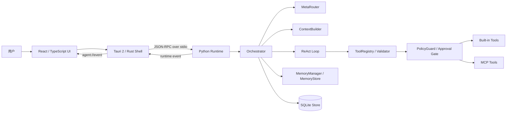

## 3. 启动与运行

完整桌面应用：

```powershell
cd app
npm install
npm run tauri:dev
```

仅前端开发：

```powershell
cd app
npm run dev
```

仅 Python runtime：

```powershell
cd runtime
python -m local_agent_runtime.main
```

常用校验：

```powershell
cd app
npm run typecheck
npm test
```

```powershell
cd runtime
python -m pytest -q -p no:cacheprovider
```

Tauri 启动 Python runtime 时，会读取 `LOCAL_AGENT_PYTHON`，默认使用 `python`，并执行 `python -u -m local_agent_runtime.main`。同时会设置 runtime 的 `PYTHONPATH` 与 `LOCAL_AGENT_DB_PATH`。

## 4. RPC 与事件系统

当前 `runtime/src/local_agent_runtime/rpc/server.py` 中，`JsonRpcServer` 注册了 90 个 JSON-RPC handler。主要分组如下：

| 分组 | 代表方法 |
| --- | --- |
| workspace | `workspace.open`, `workspace.focus.update`, `workspace.memory.clear` |
| session/message/task | `session.create`, `message.send`, `task.cancel`, `task.pause`, `task.resume` |
| approval/config/provider | `approval.submit`, `config.get`, `config.update`, `provider.test` |
| trace/proposal/decision | `trace.list`, `decision.list`, `proposal.list`, `provider_turn.list` |
| schedule/collab | `schedule.create`, `collab.task.create`, `collab.worker.heartbeat` |
| skill/mcp | `skill.list`, `skill.create`, `mcp.server.create`, `mcp.tools.refresh` |
| context/memory/feature | `context_snapshot.get`, `memory.list`, `memory.promote`, `feature.set` |
| hooks | `hook.create`, `hook.update`, `hook.list`, `hook.listExecutions` |
| events | `events.after` |

事件口径：

```text
Python stdout JSON line
  {"kind": "event", "payload": {...}}
    -> Tauri
    -> agent://event
    -> 前端订阅并更新状态
```

RPC 与事件流：

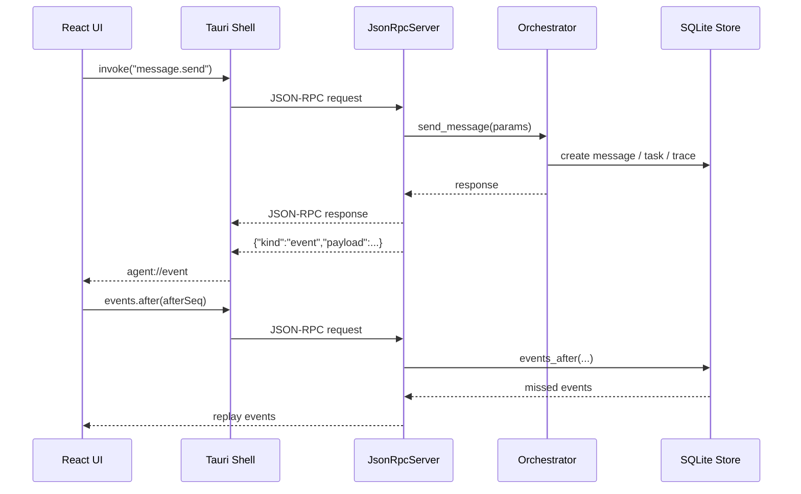

`events.after` 用于按序号补拉事件，适合 UI 断线、刷新、后台命令恢复后追平状态。

## 5. Agent 执行流程

默认请求从 `message.send` 进入，由 Orchestrator 创建/更新消息和任务，再经 MetaRouter 选择执行策略。

当前执行权边界是合理的：

1. LLM 可以参与路由建议、任务规划、压缩判断、工具调用建议和最终回答生成。
2. 真正执行工具前仍经过 runtime validator、policy guard、approval gate、预算限制和任务状态检查。
3. LLM 不应直接越权写文件、执行命令、绕过审批或修改权限边界。

ReAct 主循环可以理解为：

```text
构建上下文
  -> LLM 思考并输出 final 或 tool_calls
  -> runtime 校验工具调用
  -> 必要时请求审批
  -> 执行工具
  -> 观察结果写回上下文
  -> 判断是否继续、压缩、暂停、取消或完成
```

ReAct 状态图：

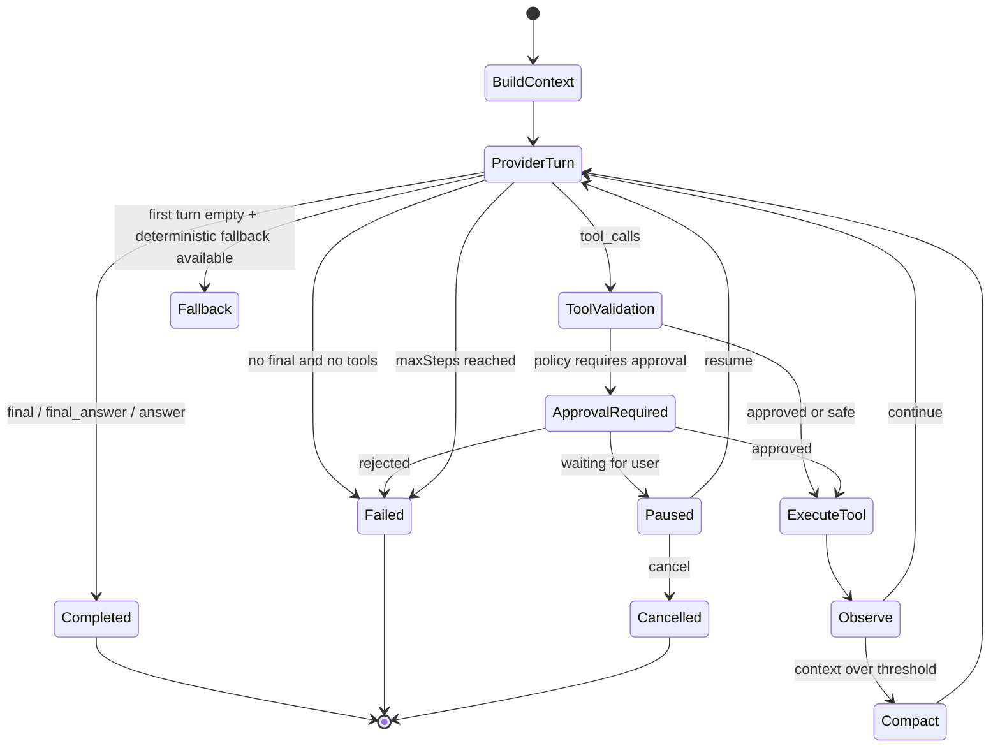

`maxSteps` 是安全上限，不是必须执行的次数。当前默认配置里常见值是 20；如果 LLM 给出明确 final answer，或者没有必要继续调用工具，任务可以提前结束。若达到上限仍没有 final answer，会失败并提示达到 `maxTaskSteps`。

无 final/无 tool_calls 的情况需要区分：

1. 如果已经进入 ReAct 且允许 plain message 作为最终答案，普通文本可以作为 final。
2. 如果第一轮没有 final、没有工具调用，只有在 deterministic fallback provider 可用时才走 fallback。
3. 如果没有 fallback，runtime 会认为 provider 没有返回可执行结果，任务失败。

暂停/取消/恢复：

1. `task.cancel` 用于终止任务，后续不会继续执行剩余工具。
2. `task.pause` 会保存 pending state，包括待执行工具和上下文状态。
3. `task.resume` 会从保存的 pending state 恢复执行。
4. 后续再次提问时，历史会话消息、结构化 memory、trace/proposal/context snapshot 可作为上下文来源，但是否进入当前 prompt 取决于 ContextBuilder、memory recall 与预算。

## 6. 上下文与压缩

当前默认上下文预算是 256000 tokens，对应 `DEFAULT_MAX_CONTEXT_TOKENS` 与默认配置 `maxContextTokens`。

ReAct 过程中，工具结果累积后会调用 `ContextCompactor.should_compact(messages, 60000)` 做滚动压缩判断。因此这里有两个不同口径：

| 口径 | 当前值 | 含义 |
| --- | --- | --- |
| 默认最大上下文预算 | 256000 | 构建任务上下文时的 provider/context 预算上限。 |
| ReAct 滚动压缩阈值 | 60000 | 工具观察结果累积后，为避免循环上下文膨胀而使用的压缩阈值。 |

压缩不等于删除信息。正确目标是把较早的交互、工具观察、阶段性结论压成可继续推理的摘要，同时保留当前任务所需的关键事实、约束、文件路径、审批状态和未完成动作。

上下文构建与压缩位置：

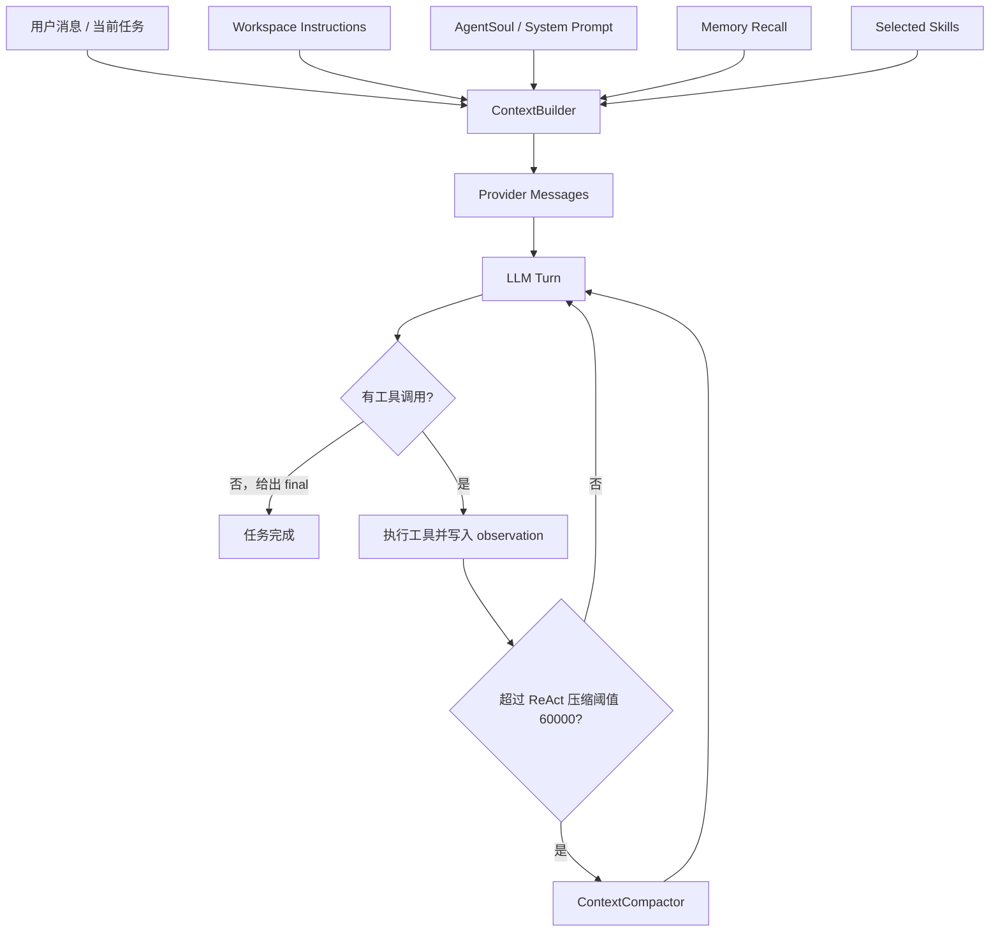

## 7. 记忆系统

原 `CONTEXT_MEMORY.md` 中把 memory 描述成 `MEMORY.md` + frontmatter，这与当前代码不一致。当前记忆系统是 SQLite 结构化存储，核心类型在 `runtime/src/local_agent_runtime/memory/types.py`。

当前 memory 主要字段：

| 字段 | 含义 |
| --- | --- |
| `kind` | `working`, `session`, `long_term`, `semantic` |
| `category` | `user_preference`, `project_convention`, `workspace_fact`, `task_learning`, `decision`, `open_issue`, `tooling`, `implementation_note` |
| `scope` | `session`, `workspace`, `user`, `global` |
| `source` | `task_result`, `user_message`, `assistant_summary`, `manual`, `supplement` |

当前更合理的 recall 口径是 workspace 优先、session 加权，而不是 workspace + session 同时硬过滤。也就是说：

1. 同一 workspace 的长期事实、项目约定、决策记录优先进入候选。
2. 当前 session 相关记忆增加权重，但不应排除跨 session 的 workspace 记忆。
3. 用户级和全局级 memory 可以作为补充，但需要受 relevance、scope 和预算约束。

ReAct 当前会在第一步附近调用结构化 recall，将相关 memory 作为系统上下文注入。任务结束后也可以把阶段性结果沉淀成 working/session/long_term memory。

记忆召回优先级：

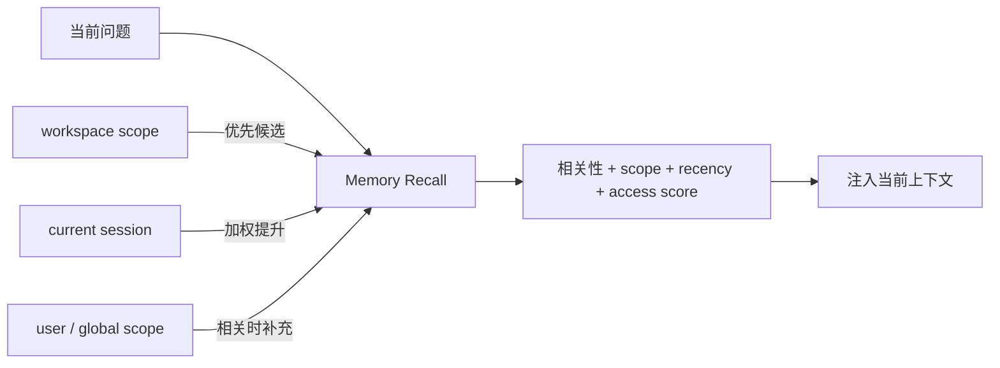

## 8. Prompt Layering 与 Agent Soul

当前比较合理的 prompt 分层应保持为：

```text
runtime safety / policy
  -> role / capability profile
  -> AgentSoul / custom system prompt
  -> workspace instructions
  -> selected skills / tool instructions
  -> recalled memory
  -> task snapshot
  -> user message
```

这里的关键原则是：用户可配置的 Soul 和系统提示词可以影响风格、偏好、工作习惯和角色倾向，但不应覆盖 runtime safety、权限边界、审批策略、工具 schema 和预算限制。

任务 snapshot 应记录本次任务实际使用的配置，包括：

1. autonomy profile。
2. role 或动态生成的 role。
3. AgentSoul/system prompt 版本。
4. 工具 allowlist 与审批策略。
5. 上下文预算、压缩阈值、maxSteps。

这样后续才能审计、复现和回放。

## 9. 工具与 MCP

当前内置工具总数是 17 个：

| 类型 | 工具 |
| --- | --- |
| 文件读取/搜索 | `list_dir`, `search_files`, `read_file` |
| 任务与执行 | `task`, `run_command`, `apply_patch` |
| Git | `git_status`, `git_diff` |
| 文件写入 | `write_file` |
| 网络/代码/浏览器 | `web_fetch`, `code_search`, `notebook`, `browser` |
| Memory | `memory.remember`, `memory.recall` |
| Scratchpad | `scratchpad.write`, `scratchpad.read` |

MCP 工具通过 server 配置动态接入，支持的 transport 包括 `stdio`、`sse`、`streamable_http`。接入后的工具名采用命名空间格式：

```text
mcp__{server_id}__{tool_name}
```

工具执行安全链路：

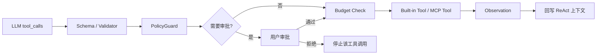

安全边界：

1. 工具 schema 负责参数结构。
2. ToolRegistry/validator 负责基本校验。
3. PolicyGuard/approval gate 决定是否需要用户批准。
4. Worker budget 限制工具调用次数、时间、成本等维度。
5. 对子任务应使用 allowlist，默认倾向只给读工具，只有明确需要时才给 `run_command` 或 `apply_patch`。

### 9.1 ToolPolicyResolver：动态工具裁剪设计

当前工具暴露方式的主要问题是：ContextBuilder/ToolRegistry 会构建一份较完整的工具集合，ReAct loop 又在多个 provider turn 中复用它。这样虽然能降低“模型需要工具但缺工具”的概率，但会带来四类风险：

1. **速度与成本**：每轮都携带 17 个内置工具加 MCP 动态工具，prompt 体积变大，真实 LLM 的响应延迟明显增加。
2. **流程误导**：root 已经收到子任务结果、只需要 synthesis 时，模型仍看到 `task`、写文件和命令工具，容易继续发起动作而不是总结。
3. **权限边界变模糊**：reviewer/summarizer/child worker 看到过多工具时，容易误以为自己可以执行写入或命令。
4. **审计困难**：trace 只能看到工具调用结果，不容易解释“为什么这一轮给了这些工具”。

因此后续应引入 `ToolPolicyResolver`，把“有哪些工具注册在系统里”和“这一轮允许暴露给 LLM 的工具”分开。

设计目标：

1. **按阶段裁剪**：不同 ReAct phase 暴露不同工具，而不是全量工具常驻。
2. **按角色裁剪**：root/worker/reviewer/planner/summarizer 以及 LLM 生成的动态 agentType，都必须落到可审计 runtime role 与 tool scope。
3. **按权限裁剪**：PermissionEngine、approval mode、child allowlist、skill policy、MCP server policy 都参与最终结果。
4. **按任务状态裁剪**：任务已经完成、取消、暂停、等待审批、或子任务结果已经返回时，不再给无关工具。
5. **可审计可回放**：每个 provider turn 记录最终暴露的 tool names、裁剪原因、策略版本和输入快照。

建议接口：

```python
class ToolPolicyResolver:
    def resolve(self, *, task, context, phase, role, routing, permission_profile, skill_policy, child_allowlist, tool_registry):
        return ToolPolicyDecision(
            tools=[...],
            phase=phase,
            role=role,
            allowed_names=[...],
            denied_names=[...],
            reasons={...},
            policy_version="tool-policy-v1",
        )
```

阶段建议：

| phase | 触发条件 | 默认工具策略 |
| --- | --- | --- |
| `planning` | 初始路由、拆任务、制定执行计划 | root 可见 `task`、只读工具；不默认给写工具。 |
| `investigation` | 需要理解项目、查文件、查状态 | `list_dir`、`search_files`、`read_file`、`git_status`、`git_diff`，必要时给受限 MCP 只读工具。 |
| `execution` | 明确需要改文件或跑命令 | 在 PermissionEngine/approval/worktree 约束下给 `write_file`、`apply_patch`、`run_command`。 |
| `review` | 检查结果、找问题、验收 | 默认只读；除非是专门的修复 worker，否则不给写工具。 |
| `synthesis` | 汇总子任务结果、给最终结论 | 默认不给 tools；只允许模型基于已有 observation 总结。 |
| `approval_waiting` | 等用户审批 | 不给新工具；只保留恢复/审批后的 pending state。 |
| `recovery` | 工具失败、超时、格式错误后修复 | 只给恢复所需的最小工具，例如重新读取、重新应用小补丁。 |

角色默认策略：

runtime role 应保持少量、稳定、偏底层，主要表达权限桶和执行边界；它不应该承担所有业务身份、专家类型或个性配置。LLM 或用户可以生成动态 agent profile，但最终执行必须映射到一个可审计的 runtime role。

| runtime role | 默认工具范围 | 说明 |
| --- | --- | --- |
| `root` | routing 决定；planning 可用 `task`，synthesis 无工具 | root 负责任务编排和最终汇总，不应在汇总轮继续全量带工具。 |
| `worker` | child allowlist + PermissionEngine | 动态 agentType 只是 metadata，runtime role 默认落到 `worker`。 |
| `reviewer` | 只读工具 | 负责找问题、验收和风险提示，不默认写入。 |
| `planner` | 只读 + `task` proposal 能力 | 负责拆解，不直接执行高风险写入。 |
| `summarizer` | 默认无工具或只读 | 负责压缩和归纳，不发起新动作。 |

推荐分层：

```text
runtimeRole = 系统权限桶 / 执行模式
agentType = LLM 或用户生成的具体身份名称
agentProfile = 能力、提示词、工具偏好、范围、风险等级的结构化快照
```

示例：

```yaml
runtimeRole: worker
agentType: structure-agent
agentProfile:
  displayName: Structure Agent
  capabilities:
    - read_project
    - summarize_modules
  toolPolicy: read_only
  scopes:
    - runtime/src
    - runtime/tests
  riskLevel: low
```

设计原则：

1. 固定 runtime role 不等于固定 agent 种类；它只负责把权限、安全、工具裁剪和审计落到稳定边界上。
2. 动态 agentType/profile 可以由 LLM proposal 生成，也可以由用户在设置页保存成 profile。
3. runtime 必须保存 role snapshot：`runtimeRole`、`agentType`、`agentProfile`、tool policy、prompt layers、scope、risk、budget。
4. 未知 agentType 不应导致任务失败；默认映射到 `worker`，并通过 profile/allowlist/PermissionEngine 限权。
5. 如果 LLM 建议的 agent profile 请求更高权限，必须经过 validator、policy guard 或用户审批，不允许 profile 自己扩大权限。

#### 9.1.1 详细设计：Dynamic Agent Profile

目标是把“动态智能体身份”做成可配置、可审计、可回放的结构，而不是把所有身份都硬塞进 `runtimeRole` enum。

核心对象：

```python
@dataclass
class AgentProfile:
    id: str
    display_name: str
    agent_type: str
    base_runtime_role: Literal["worker", "planner", "reviewer", "summarizer"]
    description: str
    capabilities: list[str]
    scopes: list[str]
    tool_policy: str
    prompt_layers: list[dict[str, Any]]
    risk_level: Literal["low", "medium", "high"]
    budget: dict[str, Any]
    source: Literal["user_saved", "llm_proposed", "system_default"]
    version: int
```

任务执行时必须冻结成 snapshot，避免后续设置变更影响历史回放：

```python
@dataclass
class RoleSnapshot:
    runtime_role: str
    agent_type: str
    profile_id: str | None
    profile_version: int | None
    profile: dict[str, Any]
    resolved_tool_policy: dict[str, Any]
    prompt_layers: list[dict[str, Any]]
    scopes: list[str]
    risk_level: str
    budget: dict[str, Any]
```

建议落库位置：

| 数据 | 建议位置 | 说明 |
| --- | --- | --- |
| 可复用 profile | `agent_profiles` 表或 config JSON | 用户在设置页保存的 profiles。 |
| 单次任务 snapshot | `tasks.routing.roleSnapshot` 或独立 `task_role_snapshots` | 执行时冻结，作为审计依据。 |
| 每轮工具决策 | `provider_turns.tool_policy_decision` 或 context snapshot metadata | 回放“这一轮为什么给这些工具”。 |
| LLM proposal | `proposal_records` | LLM 生成 profile 时必须记录 proposal、validator 结果和 fallback。 |

LLM 生成 profile 的流程：

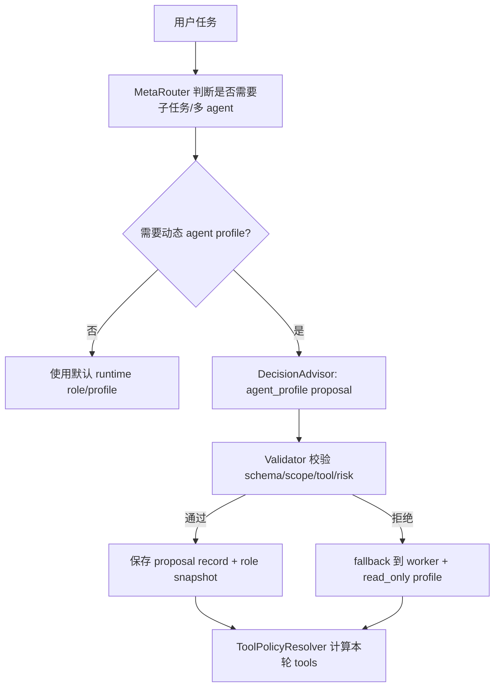

`agent_profile` proposal schema 建议：

```json
{
  "agentType": "structure-agent",
  "displayName": "Structure Agent",
  "baseRuntimeRole": "worker",
  "description": "Inspect project layout and summarize module boundaries.",
  "capabilities": ["read_project", "summarize_modules"],
  "scopes": ["runtime/src", "runtime/tests"],
  "toolPolicy": "read_only",
  "riskLevel": "low",
  "budget": {
    "maxToolCalls": 6,
    "timeoutSeconds": 120
  },
  "promptHints": [
    "Focus on structure and risk, do not edit files."
  ]
}
```

Validator 规则：

1. `baseRuntimeRole` 必须落在固定 runtime role 集合中；未知值 fallback 到 `worker`。
2. `agentType` 可以自由命名，但必须是短字符串，不能包含路径、命令、密钥或提示注入文本。
3. `toolPolicy` 只能引用已有 policy preset，例如 `read_only`、`write_with_approval`、`review_only`。
4. `scopes` 必须落在 workspace 内，不能包含 `..`、绝对系统目录或未授权路径。
5. `riskLevel=high` 或请求写工具/命令工具时，必须进入 approval 或降级为只读。
6. `promptHints` 只能作为 profile layer，不能覆盖 runtime safety、PermissionEngine、approval policy 和 budget。

权限提升规则：

| 请求 | 默认处理 |
| --- | --- |
| 动态 profile 请求只读工具 | 可自动接受，但仍记录 proposal。 |
| 请求 `write_file` / `apply_patch` | 需要 PermissionEngine 允许；默认走审批或 worktree。 |
| 请求 `run_command` | 需要命令策略允许；高风险命令必须审批。 |
| 请求 MCP 工具 | 必须匹配 MCP server policy 和 tool allowlist。 |
| 请求扩大 workspace scope | 默认拒绝或要求用户批准。 |
| 请求修改自己的权限/profile | 拒绝，profile 不能自我提权。 |

#### 9.1.2 详细设计：ToolPolicyResolver

Resolver 的职责不是注册工具，而是在每一轮 provider turn 前计算“本轮允许暴露给 LLM 的工具”。

输入：

| 输入 | 来源 | 用途 |
| --- | --- | --- |
| `task` | store | task status、role、routing、root/child 关系。 |
| `context` | ContextBuilder/ReAct state | workspace、skill、budget、messages、tool results。 |
| `phase` | ReAct phase detector | 决定 planning/investigation/execution/review/synthesis。 |
| `roleSnapshot` | task routing/snapshot | runtimeRole、agentType、profile、scope、risk。 |
| `permissionProfile` | PermissionEngine/config | 判断工具是否允许、审批、拒绝。 |
| `skillPolicy` | Skill registry | skill 白名单、MCP 继承策略。 |
| `childAllowlist` | subagent request/budget | 限制 child worker 可见工具。 |
| `toolRegistry` | ToolRegistry/MCP manager | 所有已注册工具 schema。 |

输出：

```python
@dataclass
class ToolPolicyDecision:
    phase: str
    runtime_role: str
    agent_type: str
    allowed_tools: list[dict[str, Any]]
    allowed_tool_names: list[str]
    denied_tool_names: list[str]
    reasons: dict[str, str]
    requires_approval: list[str]
    policy_version: str
```

决策顺序：

```text
all registered tools
  -> phase filter
  -> runtime role filter
  -> agent profile tool policy
  -> child allowlist
  -> skill policy
  -> MCP server policy
  -> PermissionEngine
  -> approval/worktree/budget constraints
  -> final provider tools
```

phase 推断规则：

| 条件 | phase |
| --- | --- |
| 任务刚开始，routing strategy 是 plan/swarm | `planning` |
| 模型需要理解项目，最近没有写工具结果 | `investigation` |
| 用户目标或计划明确要求修改文件/运行命令 | `execution` |
| role 是 `reviewer` 或任务处于验收环节 | `review` |
| 上一轮最后一个 observation 是 `task` 且没有 waiting approval | `synthesis` |
| task status 是 `waiting_approval` | `approval_waiting` |
| 上一轮工具失败、patch 校验失败、provider 格式失败 | `recovery` |

默认工具矩阵：

| phase / role | root | worker | reviewer | planner | summarizer |
| --- | --- | --- | --- | --- | --- |
| `planning` | `task`, read tools | read tools | read tools | `task`, read tools | none |
| `investigation` | read tools | allowlist read tools | read tools | read tools | read tools |
| `execution` | write/command with approval | allowlist + permission | read only | read only | none |
| `review` | read tools | read tools | read tools | read tools | read tools |
| `synthesis` | none | none | read tools if needed | none | none |
| `approval_waiting` | none | none | none | none | none |
| `recovery` | minimal repair tools | minimal allowlist tools | read tools | read tools | none |

审计 payload 示例：

```json
{
  "phase": "synthesis",
  "runtimeRole": "root",
  "agentType": "root",
  "policyVersion": "tool-policy-v1",
  "allowedToolNames": [],
  "deniedToolNames": ["task", "read_file", "write_file", "run_command"],
  "reasons": {
    "task": "phase=synthesis after child task results",
    "write_file": "phase=synthesis denies write tools"
  }
}
```

#### 9.1.3 设置页与 RPC 设计

设置页不应该直接让用户编辑底层 runtime role enum，而应该提供 profile 管理。

建议 RPC：

| RPC | 用途 |
| --- | --- |
| `agent.profile.list` | 列出用户保存和系统默认 profiles。 |
| `agent.profile.create` | 创建自定义 profile。 |
| `agent.profile.update` | 更新 profile，新版本号递增。 |
| `agent.profile.delete` | 删除未被锁定的 profile。 |
| `agent.profile.previewTools` | 选择 role/phase/permission/scope 后预览最终工具集合。 |
| `agent.profile.validate` | 保存前校验 schema、scope、tool policy、prompt 安全。 |

设置页字段：

1. Profile 名称、描述、默认 runtime role。
2. Capabilities 标签。
3. Scope 限制。
4. Tool policy preset。
5. Prompt hints / style / domain instructions。
6. Risk level 与默认 budget。
7. “预览工具”面板：展示不同 phase 下最终可见工具。

#### 9.1.4 迁移步骤与验收

P0 最小闭环：

1. 增加 `ToolPolicyResolver`，先覆盖 root synthesis、child worker、reviewer 只读三类高价值路径。
2. 增加 `RoleSnapshot` 生成逻辑，任务创建时冻结 `runtimeRole/agentType/profile/toolPolicy/scope/risk/budget`。
3. provider turn/context snapshot 写入 `toolPolicyDecision`。
4. 新增测试：root 第一轮可见 `task`，task result 后 synthesis 轮 tools 为 0。
5. 新增测试：未知 `agentType=structure-agent` 不失败，runtime role 映射为 `worker`，profile 被保存进 snapshot。
6. 新增测试：reviewer 不可见写工具；child worker 只能看到 allowlist + PermissionEngine 允许的交集。
7. 真实 GLM smoke：两个 child worker 完成后 root 汇总，不再携带 17 tools。

P1 扩展：

1. 接入 settings profile CRUD。
2. 接入 LLM `agent_profile` proposal。
3. 接入 MCP server policy 和 skill tool policy。
4. 做 provider turn 回放页，能解释每轮工具暴露原因。

第一阶段实现边界：

1. 在 `runtime/src/local_agent_runtime/orchestrator/react_runner.py` 中替换当前 `_provider_tools(context)` 的直接使用，增加 `_provider_tools_for_turn(...)` 到独立 resolver 的迁移路径。
2. 当上一轮最后一个 observation 是 `task` 结果且没有等待审批时，下一轮强制进入 `synthesis`，`tools/openai_tools=[]`。
3. child worker 默认跳过 context/completion 这类辅助 advisor，除非配置显式开启。
4. context policy advisor 只有在接近 compaction threshold 时才调用，避免每次 ReAct 都多打一轮 LLM。
5. provider turn / context snapshot 记录 `toolPolicyDecision`，至少包含 `phase`、`role`、`allowedToolNames`、`deniedToolNames`、`reason`。

第二阶段实现边界：

1. 将 skill tool policy、MCP tool policy、PermissionEngine、child allowlist 合并进统一 resolver。
2. 给设置页增加“工具暴露策略”只读预览：选择 role/phase/permission 后展示最终工具集合。
3. 增加真实 LLM smoke：root 第一轮带 `task`，两个 child worker 只拿只读工具，root synthesis 轮工具数为 0，最终完成。
4. 增加回放测试：从 provider_turn/context_snapshot 还原当时为什么给了这些工具。

当前已完成的止血修复：

1. root 收到 `task` 子任务结果后，下一轮进入 synthesis，不再携带全量 tools。
2. context policy advisor 改为接近上下文压力时才调用。
3. child worker 默认不跑辅助 context/completion advisor。
4. 聚焦测试和真实 GLM-5.1 子 worker smoke 已通过。

这块应列为 P0，因为它同时影响稳定性、性能、权限、安全和可审计性。

## 10. DAG、多 Agent 与并行

DAG 规划适合处理有明确依赖关系的任务。当前 DAG 执行器可以把无依赖或同一依赖层级的节点并行执行；有依赖的节点必须等待上游完成。

```text
A: 读取需求
  -> B: 修改后端
  -> C: 修改前端
  -> D: 测试验证
```

DAG 并行示意：

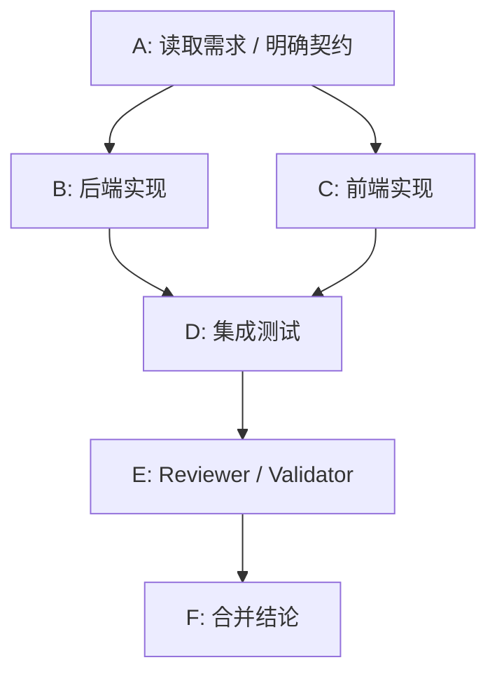

如果 B 和 C 没有共享写入文件、接口契约已经明确，它们可以并行；如果 B 的输出会影响 C 的实现，则需要串行或先产出契约再并行。

Supervisor/Swarm 更适合多 agent 协作，但应满足：

1. 每个 worker 有明确任务边界和写入范围。
2. reviewer/planner/summarizer 等角色可以由 LLM 建议生成，但最终要落成可审计的 role snapshot。
3. 多 agent 并行前必须检查文件写入冲突、共享上下文、预算和取消/暂停传播。
4. 合并结果必须经过 validator/test/review，不应直接采纳任一 worker 的输出。

## 11. 当前已知偏差与建议修正

| 问题 | 影响 | 建议 |
| --- | --- | --- |
| 原文档 RPC 数量写 120+ | 会误导 API 覆盖判断 | 改为“当前 90 个 handler，以代码为准”。 |
| 原文档工具数量写 16 | 与当前 registry 不一致 | 改为 17，并列出 memory/scratchpad 工具。 |
| 原文档 memory 描述为 `MEMORY.md` | 与 SQLite 结构化 memory 不一致 | 改为 MemoryStore/MemoryManager/MemoryEntry 口径。 |
| 原文档压缩阈值有 6000 的旧口径 | 与当前配置不一致 | 改为默认上下文 256000，ReAct 滚动压缩 60000。 |
| 原文档把 `maxSteps` 容易读成固定步数 | 会误解 agent 结束条件 | 明确它是上限，final answer 可提前结束。 |
| 原文档 fallback 描述过宽 | 会误解 provider 无输出时的行为 | 明确只有 deterministic fallback provider 可用才 fallback。 |

## 12. 当前能力状态矩阵

| 能力 | 当前状态 | 判断 |
| --- | --- | --- |
| 桌面应用启动 | 已有 | Tauri 启动 Python runtime，前端通过 JSON-RPC 调用。 |
| 会话/任务/消息 | 已有 | session、message、task RPC 已接入，任务状态可追踪。 |
| 事件回放 | 已有 | runtime event + `events.after` 可支撑 UI 追平。 |
| ReAct 工具循环 | 已有 | 支持工具调用、观察结果、压缩、maxSteps、失败处理。 |
| 暂停/恢复/取消 | 已有运行时能力 | `task.pause`、`task.resume`、`task.cancel` 存在；前端体验还可以继续打磨。 |
| Autonomy 配置 | 已有基础 | 默认 L0/L1/L2/L3 配置存在，设置页已有基础入口。 |
| AgentSoul 配置 | 已有基础 | 支持 identity、principles、style、custom system prompt、workspace instructions。 |
| Prompt layering | 已有基础 | context snapshot 中记录 prompt layers，AgentSoul 不覆盖 safety。 |
| 结构化 memory | 已有基础 | SQLite memory 类型、scope、source、recall 能力存在。 |
| 跨 session workspace memory | 部分接通 | memory 数据模型支持；实际召回质量还需要持续验证和调参。 |
| LLM routing proposal | 部分接通 | MetaRouter 可走 DecisionAdvisor；默认 provider 是 mock，真实 LLM 需要配置 provider。 |
| LLM 上下文压缩建议 | 部分接通 | compactor 支持 provider advisory；ReAct 当前仍有固定 60000 阈值。 |
| LLM 拆任务/并行建议 | 规划/部分基础 | DecisionAdvisor 有 `decomposition` 类型，DAG/worker 基础存在，但默认完整闭环还需补齐。 |
| Proposal 审计 | 已有基础 | proposal_records 已存在；需要保证所有关键默认路径都写入 proposal record。 |
| 通用 Hooks | 生命周期、P2 actions 与 Settings UI 已接通 | runtime hooks 的 CRUD、执行记录、HookService、hook RPC 已有；`before/after task`、`before/after tool`、`before/after provider turn`、pause/cancel/resume、compaction、context snapshot、worktree create/merge 已统一触发。`run_command`、`webhook`、`memory_write`、`auto_verification_suggestion`、`external_sync` 已走 PermissionEngine/审计记录；Settings UI 管理入口已完成。剩余主要是真实 provider + hook side effect 组合 smoke。 |

状态总览图：

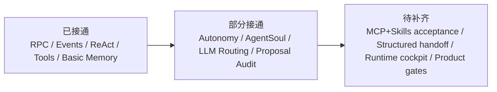

## 13. 默认配置速查

| 配置 | 当前默认值 | 含义 |
| --- | --- | --- |
| provider mode | `mock` | 默认不一定真实调用 LLM；需要配置 provider/API key 后才是实际 LLM 决策。 |
| provider model | `gpt-5-codex` | 默认模型配置字段，实际可按 provider profile 调整。 |
| max output tokens | `4000` | 单次输出预算。 |
| max context tokens | `256000` | 默认上下文预算。 |
| approval mode | `on_write_or_command` | 写文件或执行命令需要审批。 |
| max task steps | `20` | ReAct/task 步数上限，不是固定步数。 |
| patch repair attempts | `2` | patch 自动修复尝试次数上限。 |
| command timeout | `600000ms` | 命令默认超时 10 分钟。 |
| active autonomy | `balanced` / L2 | 默认允许子 agent、后台、写入/命令需审批。 |
| max parallel subtasks | `4` | 默认并行子任务上限。 |
| memory recall policy | `workspace_first_session_boosted` | workspace 优先，session 加权。 |
| agent soul | `default` | 默认启用，但默认 baseline 不额外注入个性化 prompt。 |

Autonomy 默认层级：

| Profile | Level | maxSteps | maxParallelSubtasks | 适用场景 |
| --- | --- | --- | --- | --- |
| locked_down | L0 | 4 | 1 | 高风险环境，只做很小范围动作。 |
| conservative | L1 | 10 | 2 | 需要更多用户确认的日常任务。 |
| balanced | L2 | 20 | 4 | 当前默认，适合大多数开发任务。 |
| autonomous | L3 | 40 | 6 | 较长任务，仍保留关键安全边界。 |

## 14. LLM 决策接入矩阵

核心原则：LLM 给建议，runtime 做验证和执行。也就是说，LLM 可以提出 proposal，但不能绕过 validator、policy、approval、budget 和 workspace 边界。

| 决策点 | 当前接入情况 | 应补齐的标准 |
| --- | --- | --- |
| intent mode | DecisionAdvisor 已定义 | 默认入口要记录 proposal 或明确 rule fallback。 |
| routing strategy | MetaRouter 已可接 DecisionAdvisor | 确保真实 provider 配置后默认 runtime 会生成可审计 proposal。 |
| context policy | DecisionAdvisor 已定义，ContextBuilder 有预算/层级 | 让 LLM 建议 include/drop/compact，但 hard budget 仍由 runtime 执行。 |
| decomposition | DecisionAdvisor 已定义 | LLM 可建议是否拆任务、DAG、并行度；runtime 校验依赖、写入范围和预算。 |
| react turn decision | DecisionAdvisor 已定义 | 每轮继续/停止/提问/审批建议应可记录，但 final authority 仍在 ReAct parser 与 runtime 状态机。 |
| completion decision | DecisionAdvisor 已定义 | LLM 可判断是否完成；runtime 结合测试、文件状态、审批状态做最终落库。 |
| tool scope | validator/policy 已有 | LLM 只能建议工具集合，实际工具 allowlist 和审批由 runtime 控制。 |
| memory recall | memory recall 已有基础 | LLM 可建议 recall focus；runtime 用 scope/relevance/budget 控制注入。 |

LLM 决策闭环：

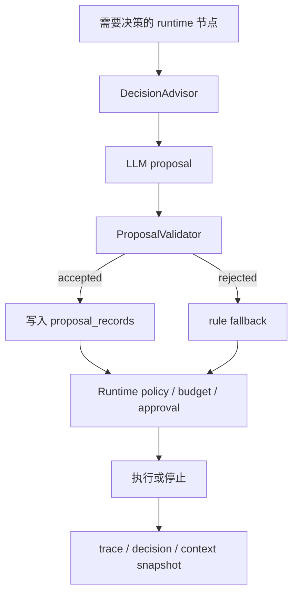

## 15. Hooks 与扩展点规划

这里的 hooks 不是简单的 webhook，而是 agent 生命周期中的可配置扩展点。它应该服务于审计、自动验证、外部通知、策略加固和团队流程。

当前代码的 hook repository 已允许核心生命周期事件：

```text
before_task_start
after_task_complete
on_task_failed
on_task_cancel
on_task_pause
on_approval_required
before_tool_call
after_tool_call
before_provider_turn
after_provider_turn
before_compaction
after_compaction
on_task_resume
before_worktree_create
after_worktree_create
before_worktree_merge
after_worktree_merge
on_context_snapshot
```

它们已经有存储、RPC、`HookService` 和测试，并已接入默认 runtime 生命周期：任务启动/完成/失败/暂停/取消/恢复、工具执行前后、provider turn 前后、上下文压缩前后、context snapshot、worktree create/merge 都会触发对应 hook。`run_command` hook side effect 会经过 `PermissionEngine`；deny 会阻断执行，approval-required 会落到 approval 结果而不是绕过权限边界。后续 hook 工作重点转为 Settings 管理入口、更多动作类型，以及跨团队通知/审计模板。

P0 最小本地开发闭环：8 个。

| Hook | 触发时机 | 典型用途 |
| --- | --- | --- |
| `before_task_start` | 任务创建后、执行前 | 注入项目规则、检查权限、记录审计上下文。 |
| `after_task_complete` | 任务完成后 | 自动验证、生成总结、写入 memory、更新计划表。 |
| `on_task_failed` | 任务失败时 | 记录失败原因、通知用户、创建 follow-up。 |
| `on_task_cancel` | 任务取消时 | 清理 pending state、标记未完成原因。 |
| `on_task_pause` | 任务暂停时 | 保存 resume snapshot、通知 UI。 |
| `on_approval_required` | 需要用户审批时 | 发送通知、记录审批上下文、阻断高风险动作。 |
| `before_tool_call` | 工具执行前 | 权限检查、审批、路径限制、命令风险扫描。 |
| `after_tool_call` | 工具执行后 | 记录结果、抽取 memory、触发测试建议。 |

P1 Agent loop 控制：累计 13 个。

| Hook | 触发时机 | 典型用途 |
| --- | --- | --- |
| `before_provider_turn` | 每次 LLM 调用前 | 追加安全提示、做 prompt 审计、统计 token。 |
| `after_provider_turn` | LLM 返回后 | 记录 proposal、检测格式、拦截异常输出。 |
| `before_compaction` | 上下文压缩前 | 选择保留内容、记录压缩原因。 |
| `after_compaction` | 上下文压缩后 | 记录摘要质量、压缩 token、保留/丢弃内容。 |
| `on_task_resume` | 任务恢复时 | 恢复审计、校验 pending state、通知 UI。 |

P2 高级执行与隔离：长期累计约 20 个。

| Hook | 触发时机 | 典型用途 |
| --- | --- | --- |
| `before_subagent_start` | 子 agent 启动前 | 校验写入范围、预算、角色、工具 allowlist。 |
| `after_subagent_complete` | 子 agent 完成后 | 合并结果、生成 reviewer 输入、记录 artifact。 |
| `on_subagent_failed` | 子 agent 失败时 | 降级、重试、通知、创建修复任务。 |
| `before_worktree_create` | 创建任务 worktree 前 | 校验 workspace trust、分支命名、base ref。 |
| `after_worktree_create` | 创建任务 worktree 后 | 记录 worktree path、branch、通知 UI。 |
| `before_worktree_merge` | worktree 合并前 | 冲突检测、验证命令、审批检查。 |
| `after_worktree_merge` | worktree 合并后 | 记录 merge 结果、更新任务报告。 |
| `before_patch_apply` | patch 应用到真实 workspace 前 | 做 diff 风险检查、审批、冲突检测。 |
| `after_patch_apply` | patch 应用后 | 记录变更、触发测试、更新任务报告。 |
| `on_memory_write` | 写入结构化 memory 时 | 校验 scope/category/source，避免污染长期记忆。 |
| `on_context_snapshot` | 生成上下文快照时 | 记录 prompt layers、预算、配置快照，支持回放。 |

当前阶段优先用 Git worktree 做文件改动隔离，确保 agent 不直接改乱主 workspace。

Hooks 设计边界：

1. hook 可以观察、建议、补充 metadata。
2. hook 要修改执行行为时，必须走同样的 validator/policy/approval。
3. hook 的输入输出需要结构化，方便审计和回放。
4. hook 失败不能默认破坏主流程，除非配置为 blocking hook。
5. hook 配置应该进入 settings，并进入 task snapshot。

Hooks 位置图：

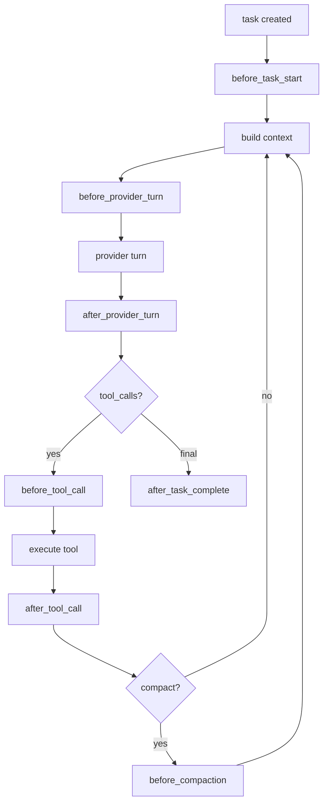

## 16. Worktree 隔离路线

近期隔离策略以 Git worktree 为主。

原因：

1. worktree 能直接解决 agent 改乱主 workspace、并行任务互相覆盖的问题。
2. worktree 天然适合 diff、review、pause/resume、cancel cleanup、merge approval。
3. worktree 能在当前 Git 项目里更快落地，不需要额外运行环境。

详细设计见：

`docs/worktree-isolation-design-plan.md`

推荐默认流程：

```text
main workspace
  -> task branch
  -> task worktree
  -> agent edits/tests inside worktree
  -> diff/report
  -> validation + approval
  -> merge/apply back to main workspace
```

优先实现：

| 阶段 | 目标 |
| --- | --- |
| P0 | `task_worktrees` 存储 + worktree store CRUD/RPC 已出现；继续补 service-backed `status/diff/cleanup` 和任务绑定。 |
| P1 | 写入类任务自动创建 worktree，工具和命令默认在 worktree cwd 执行。 |
| P2 | merge preview、验证命令、approval-required merge。 |
| P3 | 多 agent/子任务独立 worktree，合并前冲突检测和 reviewer 流程。 |

完成标准：

1. 写入类任务默认不直接修改 main workspace。
2. pause/resume 保留 worktree 现场。
3. cancel 不自动删除 dirty worktree。
4. merge 前必须有 diff、冲突检查、验证结果和用户审批。
5. task trace/report 能看到 worktree path、branch、base ref 和 merge/cleanup 记录。

## 17. 代码重构路线

当前代码已经出现若干超大文件。它们还能运行，但会逐渐拖慢需求推进、测试定位和多人协作。后续重构应作为独立工程推进，不建议夹在功能实现里顺手大改。

详细重构设计见：

`docs/code-refactoring-design-plan.md`

当前大文件快照（2026-05-14 更新）：

| 文件 | 当前行数约 | 状态 |
| --- | ---: | --- |
| `app/src/ui/workbench/workspaces/session/session.css` | 10 | ~~3151~~ → 已拆为 9 个子 CSS 文件，入口仅保留 `@import`。 |
| `app/src/ui/workbench/workspaces/session/SessionWorkspace.tsx` | 359 | ~~2824~~ → 已拆为 types + hooks + 子组件，主文件仅含布局和路由。 |
| `app/src/lib/runtimeClient.ts` | 620 | ~~1886~~ → 已移除全部 mock 基础设施，仅保留 Tauri IPC 真实路径。 |
| `app/src/ui/workbench/workspaces/settings/SettingsWorkspace.tsx` | 312 | ~~1698~~ → 已拆为 settingsTypes + providerUtils + 10 个子面板。 |
| `runtime/src/local_agent_runtime/context/builder.py` | 955 | 已降到可控范围。 |
| `runtime/src/local_agent_runtime/orchestrator/react_runner.py` | 722 | 已降到可控范围。 |
| `app/src/App.tsx` | 652 | 已从 5493 行拆到约 650 行，大文件问题已解决。 |
| `runtime/src/local_agent_runtime/orchestrator/service.py` | 346 | 已从 6722 行拆到约 350 行，作为兼容 facade。 |
| `runtime/src/local_agent_runtime/store/sqlite_store.py` | 451 | 已从 5671 行拆到约 450 行，作为兼容 facade。 |
| `runtime/src/local_agent_runtime/tools/registry.py` | 201 | 已降到可控范围。 |

2026-05-14 当前状态：后端 `service.py`（346行）、`sqlite_store.py`（451行）、
前端 `App.tsx`（652行）、`session.css`（10行）、`SessionWorkspace.tsx`（359行）、
`runtimeClient.ts`（620行）、`SettingsWorkspace.tsx`（312行）均已大幅拆分完成。
前端四大文件治理已全部完成，不再有超过阈值的文件。

重构目标不是“变短”本身，而是形成稳定边界：

1. 每个模块有明确 owner 和职责。
2. 运行时状态机、策略决策、存储访问、工具执行、UI 展示互相解耦。
3. 重构前后行为可回放、可测试、可对比。
4. 每次拆分都应有小提交、小测试面，避免一次性迁移造成不可定位回归。

建议分阶段推进：

| 阶段 | 优先级 | 目标 | 建议拆分 |
| --- | --- | --- | --- |
| R0 | P0 | 建立防回归保护 | 给 ReAct、pause/resume、memory recall、routing proposal、settings config 加聚焦测试和 trace fixture。 |
| R1 | P0 | 拆 `orchestrator/service.py` | 拆出 `task_lifecycle.py`、`react_runner.py`、`approval_flow.py`、`memory_flow.py`、`resume_flow.py`、`proposal_flow.py`。 |
| R2 | P0 | 拆 `sqlite_store.py` | 按 repository 拆成 `session_store.py`、`task_store.py`、`event_store.py`、`config_store.py`、`proposal_store.py`、`memory_store_adapter.py`，保留门面兼容旧 RPC。 |
| R3 | ~~Done~~ | ~~拆 `App.tsx`~~ | ~~已完成：5493→652 行，hooks + WorkspaceRouter 已拆出。~~ |
| R4 | ~~Done~~ | ~~拆 `SessionWorkspace.tsx`~~ | ~~已完成：2824→359 行，types + hooks + 子组件已拆出。~~ |
| R5 | P1 | 拆工具系统 | tool schema、tool handler、policy metadata 分文件；工具测试按工具族组织。 |
| R6 | ~~Done~~ | ~~拆 settings~~ | ~~已完成：1698→312 行，settingsTypes + providerUtils + 10 个子面板已拆出。~~ |

重构顺序图：

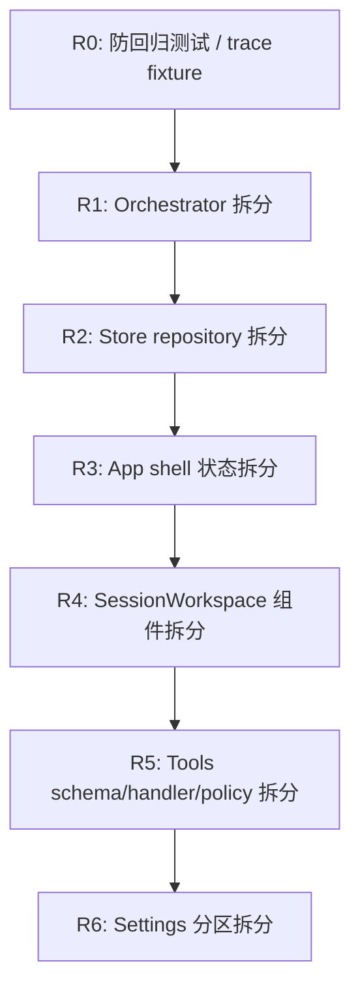

每次重构的完成标准：

1. 公共 RPC 方法名不变，除非同步更新 `shared/src/rpc.ts` 和前端调用。
2. SQLite schema 迁移只前进，不破坏旧数据。
3. 关键任务 trace 可以在重构前后对比。
4. 相关单测、类型检查通过。
5. 文档中的代码锚点同步更新。

## 18. 2026-05-13 当前代码态扫描补记

本节记录 2026-05-13 对当前工作区代码态的扫描结论，口径以实际代码、类型检查和聚焦测试为准，不只看提交记录。

### 当前已确认进展

| 领域 | 当前状态 | 代码/文档锚点 |
| --- | --- | --- |
| 前端入口拆分 | `App.tsx` 已从超大入口拆到约 500 行，入口大文件问题初步缓解。 | `app/src/App.tsx`, `app/src/hooks/*`, `app/src/ui/workbench/workspaces/WorkspaceRouter.tsx` |
| Skills 设置入口 | Skills 页面已支持导入 JSON/ZIP、导入文件夹、打开 skills 目录。 | `app/src/ui/workbench/workspaces/skills/SkillsWorkspace.tsx`, `app/src-tauri/src/lib.rs` |
| LLM 决策闭环 | 默认 routing、completion、context policy、decomposition、ReAct turn 等路径已有 `DecisionAdvisor`/`agent.decision` 接入迹象。 | `runtime/src/local_agent_runtime/main.py`, `runtime/src/local_agent_runtime/policy/decision_advisor.py`, `runtime/src/local_agent_runtime/router/meta_router.py` |
| Hooks/Worktree | `HookService`、`HookStoreMixin`、`WorktreeService`、worktree RPC/hook points 已存在并通过聚焦测试。 | `runtime/src/local_agent_runtime/services/hook_service.py`, `runtime/src/local_agent_runtime/services/worktree_service.py`, `runtime/src/local_agent_runtime/store/repositories/hook_repository.py` |
| PermissionEngine | 统一权限评估器已出现，核心工具和 web/subagent 等路径已有接入。 | `runtime/src/local_agent_runtime/policy/permission_engine.py`, `runtime/src/local_agent_runtime/tools/*` |

### 本次验证结果

- `npx.cmd tsc --noEmit` 通过。
- `cargo check` 通过。
- `npm.cmd test -- SkillsWorkspace.test.tsx` 通过，3 passed。
- `python -m pytest -q -p no:cacheprovider --basetemp D:\py\yuanbao_agent\runtime\pytest_tmp runtime/tests/test_worktree_isolation.py runtime/tests/test_runtime_hooks.py runtime/tests/test_permission_engine.py runtime/tests/test_permission_integration.py` 通过，89 passed。
- 注意：Windows 默认 pytest temp 目录 `C:\Users\ADMIN\AppData\Local\Temp\pytest-of-ADMIN` 当前权限异常；运行后端测试时应指定 workspace 内 `--basetemp`，否则会出现 setup 阶段 PermissionError，不能视为业务失败。

### 当前必须注意的问题

| 优先级 | 问题 | 影响 | 建议 |
| --- | --- | --- | --- |
| P0 | `runtime/src/local_agent_runtime/store/repositories/hook_repository.py` 当前是未跟踪文件，但 `sqlite_store.py` 已 import 它。 | 如果提交时漏掉该文件，干净 checkout 会 runtime import 失败。 | 下一次提交必须包含该文件，或者先调整引用关系。 |
| P0 | Provider API format UI 与 runtime 支持度不完全一致。 | 设置页暴露 `openai-responses`、`anthropic-messages`，但 runtime adapter 主要仍是 `openai-chat`/`chat-completions`。 | 标记未支持格式或补 adapter；优先补 `openai-responses`，再补 `anthropic-messages`。 |
| P0 | ToolPolicyResolver 尚未系统化实现。 | 当前工具暴露仍主要来自 ContextBuilder/ToolRegistry 的全量集合，虽然已对 `task` 结果后的 synthesis 轮做止血，但还没有按 phase/role/permission/skill/MCP 统一裁剪和审计。 | 实现统一 resolver；每个 provider turn 记录 phase、role、allowed/denied tools 和裁剪原因；root synthesis 轮默认 0 tools。 |
| P0 | Dynamic Agent Profile 与固定 runtime role 的分层还未完整落库和审计。 | 当前已允许未知 `agentType` 映射到 `worker`，但 profile 的 capabilities、scope、prompt layers、risk、tool policy 还没有形成统一 snapshot。 | 固定 runtime role 作为权限桶；动态 `agentType/profile` 作为身份与能力描述；任务创建时保存 role snapshot，并由 ToolPolicyResolver/PermissionEngine 执行限权。 |
| P0 | ~~Permission Policy V2 Lite~~ — **已闭环** (`5cca5e8`)。 | PermissionEngine 已有 3 presets、config normalizer、5 tool integrations、tool.blocked pipeline、56 专项测试。 | 后续 P1+ 可扩展到 hook side effects、Computer Use、temporary grants。 |
| P1 | Worktree 尚未完成写任务自动隔离。 | service/RPC/hooks 已有，但写入型任务自动绑定 worktree、工具默认在 worktree cwd 执行、UI 展示 path/diff/status 还未完全闭环。 | 继续推进 task-worktree binding、write tool cwd routing、task report/UI 展示。 |
| P1 | ~~大文件治理~~ — **已闭环**。 | `SessionWorkspace.tsx`(359)、`session.css`(10)、`runtimeClient.ts`(620)、`SettingsWorkspace.tsx`(312) 均已拆分完成。 | 前端大文件治理全部完成，后续关注新生成的大文件。 |

### 当前大文件快照

| 文件 | 当前行数约 | 判断 |
| --- | ---: | --- |
| `app/src/ui/workbench/workspaces/session/session.css` | 10 | ~~2714~~ → 已拆为 9 个子 CSS，仅保留 `@import`。 |
| `app/src/ui/workbench/workspaces/session/SessionWorkspace.tsx` | 359 | ~~2611~~ → 已拆为 types + hooks + 子组件。 |
| `app/src/lib/runtimeClient.ts` | 620 | ~~1707~~ → 已移除全部 mock，仅保留 Tauri IPC。 |
| `app/src/ui/workbench/workspaces/settings/SettingsWorkspace.tsx` | 312 | ~~1619~~ → 已拆为 12 个子文件。 |
| `app/src/App.tsx` | 约 500 | 已明显改善，不再是当前最大文件。 |

### 下一步建议顺序

1. ~~先保证提交完整性~~ — **Done** (`6af8d93`)。`hook_repository.py` 已提交。
2. ~~更新总计划中陈旧描述~~ — **Done**。App.tsx 和 Permission Policy V2 Lite 状态已更新。
3. ~~P0 Permission Policy V2 Lite~~ — **Done** (`5cca5e8`)。后续 P1+ 扩展到 hook side effects、Computer Use。
4. P0 实现 ToolPolicyResolver 与 Dynamic Agent Profile 分层：固定 runtime role 管权限桶，动态 `agentType/profile` 管身份、能力、scope 和 prompt，并记录 provider turn/role snapshot 审计快照。
5. P0/P1 对齐 Provider API format，避免设置页让用户选择 runtime 尚不能执行的格式。
6. P1 推进 task-worktree binding，让写入型任务默认在隔离 worktree 中执行。
7. ~~P1 继续大文件治理~~ — **Done**。`SessionWorkspace.tsx`(359)、`session.css`(10)、`runtimeClient.ts`(620)、`SettingsWorkspace.tsx`(312) 均已拆分完成。

## 19. 后续文档维护建议

后续建议把这份文档作为总入口，旧文档可以保留为专题说明，但需要在开头注明“以合并校正版为准”。

优先维护顺序：

1. 先维护本合并文档的事实口径：数量、阈值、默认值、执行边界。
2. 再维护专题文档：工具、MCP、上下文、DAG、API events。
3. 每次改 runtime 配置、工具 registry、RPC handler、memory schema、approval policy，都同步更新本文件。
4. 对流程类文档，建议加“代码锚点”，比如 `rpc/server.py`, `orchestrator/service.py`, `context/builder.py`, `tools/registry.py`，避免文档和实现继续漂移。
## 20. 真实 GLM-5.1 接入烟测问题与修复记录

日期：2026-05-13

本轮用真实 GLM-5.1 进行“小型静态音乐播放器”端到端烟测，目标是让 agent 在空 workspace 中创建 `index.html`、`styles.css`、`app.js`，并覆盖播放/暂停、上一首/下一首、音量、进度和播放列表。测试结论：provider 网络可以打通，但完整 agent 开发闭环尚未稳定通过。

已确认问题：

| 优先级 | 问题 | 影响 | 当前处理 |
| --- | --- | --- | --- |
| P0 | 裸 `baseUrl` 直接拼 `/chat/completions` 会返回 405。 | 用户填写 `https://df.dawnloadai.com:9888` 这类 OpenAI-compatible 根地址时，runtime 不能自动命中 `/v1/chat/completions`。 | 已修复：裸域名 base URL 自动使用 `/v1/chat/completions`。 |
| P0 | `LOCAL_AGENT_PROVIDER_*` 环境变量会被默认 `mock/gpt-5-codex` 配置覆盖。 | smoke、部署和调试场景明明设置了 `GLM-5.1`，runtime trace 仍可能显示默认模型，导致真实 LLM 主流程没有按预期接入。 | 已修复：显式 provider 环境变量优先于存储默认配置。 |
| P0 | GLM 对 DecisionAdvisor JSON-only 输出不稳定。 | routing/context/completion proposal 可能因为非 JSON 被拒绝，进入 rule fallback；仍可运行，但 LLM 决策审计闭环不稳定。 | 待修复：需要加强 advisor prompt、JSON 提取/修复、失败记录和模型能力标记。 |
| P0 | 流式工具调用可能长时间输出超大参数。 | ReAct 主流程会停在 assistant streaming，任务保持 running，文件不落盘。 | 已初步修复：增加 provider stream 总时长与单个 tool arguments 字符上限；后续仍需更细的分片写文件策略。 |
| P1 | 完成条件仍需结合验收项强校验。 | 如果 provider 没有真正创建目标文件，不能仅凭自然语言总结或 fallback 误判 completed。 | 待修复：completion decision 需要读取 changed files、目标文件、测试结果和 acceptance criteria 后再落库。 |

后续优先级：

1. P0：继续修 DecisionAdvisor JSON 兼容，保证 GLM 输出可被提取为 proposal record。
2. P0：为 ReAct 写文件类工具调用增加“大内容分片/多文件分步写入”策略，避免一次 tool call 塞完整页面代码导致流式卡住。
3. P0：完成条件必须以 acceptance criteria + workspace 文件状态 + 工具执行结果为准。
4. P1：provider 设置页明确提示 base URL 规范，保存时可自动规范化或预检 `/v1/chat/completions`。
5. P1：真实 LLM smoke 已固化为默认跳过、环境变量显式开启的 pytest；只从环境变量读取 key/base URL/model/apiFormat，不写入密钥或生成物。

2026-05-14 后端链路修复进展：

- 已增强 DecisionAdvisor JSON 提取：支持 markdown fence、前后夹杂说明文字、顶层 proposal 字段、`reasoning/explanation` 作为 rationale，以及 `assistant_message.content` 兜底。
- 已增强 ReAct provider turn：streaming 超时、超大 tool arguments、无 final 等情况下会记录 `provider.stream.fallback_non_stream`，然后自动降级为非流式请求继续执行，不再直接让任务长时间卡在 assistant streaming。
- 已移除 provider streaming 单一布尔缓存的影响，避免运行期配置从 mock/非流式切到 OpenAI-compatible 后仍沿用旧判断。
- 已补回归测试：DecisionAdvisor 解析、provider env/base URL、streaming 参数保护、streaming 失败降级到非流式后继续完成 patch approval 链路。

## 21. 2026-05-14 非大文件任务进展快照

本节只记录非“大文件拆分”任务。大文件治理仍保留在专门计划中，不作为本轮执行范围。

### 已完成并提交

| 任务 | 状态 | 提交 | 说明 |
| --- | --- | --- | --- |
| ToolPolicyResolver + Dynamic Agent Profile 最小闭环 | Done | `840d948` | 新增 runtime tool policy resolver；provider turn 使用动态工具裁剪；context snapshot 记录 `toolPolicyDecision` 与 `roleSnapshot`；root synthesis 轮默认不再暴露工具；reviewer 只读；动态 `agentType` 映射到稳定 runtime role。 |
| 真实 provider 链路加固 + Provider API format 对齐 | Done | `489d3b9` | shared 层统一 `ProviderApiFormat` 默认值/归一化；设置页将 `openai-responses`、`anthropic-messages` 标记为 planned 且不可新选；runtime 对 planned 格式明确拒绝；修复 provider env 覆盖、裸 baseUrl `/v1/chat/completions`、stream timeout、超大 tool arguments、stream 失败降级、DecisionAdvisor JSON 提取。 |
| 多 agent synthesis 验收测试 | Done | `11d9c8d` | 新增两 child worker 场景回归：root 第一轮可调用 `task`，两个动态 child agent 完成后，root synthesis 第二轮 `tools` 为空，并能形成最终总结。 |

### 本轮验证

| 验证 | 结果 |
| --- | --- |
| `python -m pytest -q -p no:cacheprovider --basetemp .pytest-local runtime/tests/test_tool_policy_resolver.py runtime/tests/test_role_system_prompt.py runtime/tests/test_provider_turns.py::TestContextSnapshotCRUD` | 22 passed |
| `python -m pytest -q -p no:cacheprovider --basetemp .pytest-local runtime/tests/test_decision_advisor.py runtime/tests/test_provider_adapter.py runtime/tests/test_provider_streaming.py runtime/tests/test_e2e_smoke.py` | 59 passed |
| `python -m pytest -q -p no:cacheprovider --basetemp .pytest-local runtime/tests/test_runtime_flows.py::test_background_task_preserves_routing_fields runtime/tests/test_runtime_flows.py::test_routing_emits_decided_event runtime/tests/test_runtime_flows.py::test_routing_creates_trace_span` | 3 passed |
| `python -m pytest -q -p no:cacheprovider --basetemp .pytest-local runtime/tests/test_multi_agent_health_report.py` | 1 passed |
| `npm.cmd test -- SettingsWorkspace.test.tsx` in `app/` | 14 passed |
| `npx.cmd tsc --noEmit` in `app/` | passed |

### 2026-05-14 补充进展：Completion Evidence

| 任务 | 状态 | 说明 |
| --- | --- | --- |
| Completion / Stop 判断强化第一阶段 | Done | `_complete_task` 会构建 `completionEvidence`，汇总 acceptance criteria、changed files、commands、verification、patches 和 tool results，并写入 `structuredResult.completionEvidence` 与 `agent.decision.completion` 事件。验证通过时标记 `evidenceLevel=verified`；只有自然语言总结时标记 `summary_only/unverified`，为后续硬 gate 留出明确输入。 |
| Completion / Stop 硬 gate 第一层 | Done | 明确写入/调试/测试/文档类任务、validate 任务、active worktree 任务，或已有 changedFiles/commands/verification 的任务，如果最终只有 `summary_only` 证据，不再直接 `completed`；runtime 会创建 `completion_review` approval，把任务停在 `waiting_approval`。用户批准后才强制完成，拒绝则 `failed/COMPLETION_REVIEW_REJECTED`。 |
| Completion / Stop 硬 gate 第二层 | Done | `failed_verification` 证据现在会直接阻止完成并落到 `failed/COMPLETION_EVIDENCE_INSUFFICIENT`；写入型任务如果已有 changed files、patch 或 write_file/apply_patch 变更证据但没有 passed verification，会进入 `completion_review`，`completionGate.status=needs_verification`。普通 command-only 任务不会被误判为需要验证。 |
| Completion / Stop 硬 gate 第三层 | Done | `completionEvidence.acceptance` 现在支持结构化验收项状态：`acceptance`、`acceptanceResults`、`acceptanceCriteriaResults` 或 `criteriaResults` 可以来自 task、validation 或 tool result。写入型任务如果显式验收证据报告 failed/unsupported，或只覆盖部分 acceptance criteria，会进入 `completion_review`，`completionGate.status=needs_acceptance_review`；没有显式逐项结果时不会用自然语言 summary 猜测。 |
| Completion / Stop 硬 gate 第四层 | Done | `completionEvidence.toolResults` 现在会标记 failed tool result，并把最后仍未被同工具后续成功结果覆盖的失败写入 `unresolvedToolFailures`。写入型任务如果存在 unresolved tool failures，会进入 `completion_review`，`completionGate.status=needs_tool_review`；失败后修复成功的 patch/command 链路不会被误拦。 |
| Completion / Stop 硬 gate 第五层 | Done | `completionEvidence.testsRun` 现在纳入证据计数；代码/测试类文件发生变更时，如果 passing verification 只有 `git_status/git_diff` 这类结构检查、没有 pytest/npm test/cargo check/typecheck/build 等目标验证信号，会进入 `completion_review`，`completionGate.status=needs_verification`。文档类改动不会被这条规则误拦。 |
| Completion Review 证据展示 | Done | 桌面端 approval card 现在会展示 `completion_review` 的 gate status、evidence level、status、指标计数和 acceptance/tool/verification issue 摘要；事件折叠层会把 `completionEvidence` 透传到会话 runtime activity。 |

验证结果：

| 验证 | 结果 |
| --- | --- |
| `python -m pytest -q -p no:cacheprovider --basetemp .pytest-local runtime/tests/test_orchestrator_react_loop.py::test_patch_completion_runs_post_task_validation_and_records_trace runtime/tests/test_decision_trace.py::TestCompletionDecisionEvent::test_completion_event_on_success runtime/tests/test_worker_structured_output.py` | 8 passed |
| `python -m pytest -q -p no:cacheprovider --basetemp .pytest-local-react runtime/tests/test_orchestrator_react_loop.py runtime/tests/test_structured_react_turn.py runtime/tests/test_decision_trace.py` | 87 passed, 1 skipped |
| `python -m pytest -q -p no:cacheprovider --basetemp .pytest-local-provider runtime/tests/test_provider_turns.py::TestContextSnapshotCRUD runtime/tests/test_multi_agent_health_report.py runtime/tests/test_e2e_smoke.py` | 11 passed |
| `python -m pytest -q -p no:cacheprovider --basetemp .pytest_tmp runtime/tests/test_worker_structured_output.py` | 20 passed |
| `python -m pytest -q -p no:cacheprovider --basetemp .pytest_tmp runtime/tests/test_orchestrator_react_loop.py::test_patch_completion_runs_post_task_validation_and_records_trace runtime/tests/test_decision_trace.py::TestCompletionDecisionEvent::test_completion_event_on_success runtime/tests/test_worker_structured_output.py` | 11 passed |
| `python -m pytest -q -p no:cacheprovider --basetemp .pytest_tmp runtime/tests/test_orchestrator_react_loop.py runtime/tests/test_structured_react_turn.py runtime/tests/test_decision_trace.py runtime/tests/test_worker_structured_output.py` | 107 passed, 1 skipped |
| `python -m pytest -q -p no:cacheprovider --basetemp .pytest_tmp runtime/tests/test_worktree_isolation.py runtime/tests/test_worktree_auto_binding.py` | 34 passed |
| `npm.cmd test -- viewComputations.test.ts SessionWorkspace.test.tsx` in `app/` | 43 passed |
| `npm.cmd run typecheck` in `app/` | passed |

剩余边界：当前硬 gate 已覆盖明确写入型/验证型任务的 `summary_only`、失败验证、有工作区变更证据但缺少 passed verification、结构化 acceptance criteria failed/缺项、unresolved tool failures、以及代码/测试文件变更但缺少目标验证的情况；基础 `completion_review` 证据摘要已经进入 UI，后续重点是继续细化更具体的语言/框架测试匹配规则，并把 reviewer/approval 结论串到更完整的完成审计里。

### 2026-05-14 Provider API format 扩展收尾

| 项目 | 状态 | 说明 |
| --- | --- | --- |
| OpenAI Responses API | Done | runtime 新增 `OpenAIResponsesClient`，将消息、tool schema、assistant function call、tool result 转换为 `/v1/responses` 形态，并把 Responses output/function_call 归一回现有 provider response 结构。 |
| Anthropic Messages API | Done | runtime 新增 `AnthropicMessagesClient`，支持 native `/v1/messages` 请求、`x-api-key` / `anthropic-version` headers、system 抽离、`tool_use` / `tool_result` 双向转换；`mode=anthropic` 默认归一为 `anthropic-messages`。 |
| provider test / trace metadata | Done | `provider.test` 与 provider turn trace 记录 effective `apiFormat`、`requestPath`、`failureReason`；active provider profile 会覆盖 root provider 设置；非 `openai-chat` provider turn 不再进入真实 streaming 路径。 |
| Settings UI / shared config | Done | `openai-responses` 与 `anthropic-messages` 已进入 shared supported format 列表，设置页不再标记为 planned/unavailable，可直接新选。 |
| 默认 endpoint 防护 | Done | Anthropic Messages 在继承默认 OpenAI base URL 时会切回 `https://api.anthropic.com`，避免 native Anthropic 请求误打到 OpenAI endpoint；显式自定义 endpoint 仍保持优先。 |

验证结果：

| 验证 | 结果 |
| --- | --- |
| `python -m pytest -q -p no:cacheprovider --basetemp .pytest_tmp_provider runtime/tests/test_provider_adapter.py runtime/tests/test_runtime_flows.py` | 63 passed |
| `npm.cmd test -- SettingsWorkspace.test.tsx` in `app/` | 14 passed |
| `npm.cmd run typecheck` in `app/` | passed |

### 2026-05-14 ToolPolicyResolver 第二阶段收尾

| 项目 | 状态 | 说明 |
| --- | --- | --- |
| PermissionEngine 合流 | Done | provider turn 工具暴露统一经过 `ToolPolicyResolver`，并把 `runCommand`、`writeFile`、`webFetch`、`subagents` 等能力交给 `PermissionEngine` 判定；deny 会阻止工具进入本轮 provider tools，approval-required 会进入决策详情。 |
| Skill / MCP policy 合流 | Done | resolver 已支持 skill strict whitelist / inherit_mcp，以及 MCP server/tool allowlist、denylist、disabled 模式；被过滤工具会记录具体原因。 |
| child allowlist 合流 | Done | child worker 的 `_child_tool_allowlist` / budget allowlist 已纳入 resolver，同一套决策输出负责限制 worker 工具暴露。 |
| provider turn 回放解释 | Done | `provider_turn.list` 现在直接返回解析后的 `toolPolicyDecision`、`roleSnapshot` 和 `toolPolicyExplanation`；audit replay timeline 也包含同样摘要，用于解释“为什么这一轮给了这些工具、禁了哪些工具”。 |

验证结果：

| 验证 | 结果 |
| --- | --- |
| `python -m pytest -q -p no:cacheprovider --basetemp .pytest_tmp_toolpolicy runtime/tests/test_tool_policy_resolver.py runtime/tests/test_provider_turns.py runtime/tests/test_replay.py` | 65 passed |

### 2026-05-14 Dynamic Agent Profile backend/RPC 收尾

| 项目 | 状态 | 说明 |
| --- | --- | --- |
| profile store/schema | Done | runtime 新增 `agent_profiles` 表与 `AgentProfileStoreMixin`，支持 profile list/get/create/update/delete，序列化 `skillIds`、`mcpServerIds`、`toolPolicy` 和系统提示等字段。 |
| profile RPC flow | Done | `agent.profile.list/create/update/delete/validate/previewTools` 已注册到 JSON-RPC；validate 覆盖基础字段与 tool policy 结构；previewTools 通过 `ToolPolicyResolver` 预览允许/拒绝工具。 |
| shared RPC/domain 类型 | Done | shared 层补齐 `AgentProfileRecord` 与 `AgentProfile*Params/Result` 类型，前端调用可以使用稳定 RPC 类型。 |
| 设置页 profile 管理 | Done | Settings 的 Agents panel 已接入 `agent.profile.*` RPC：支持 profile 列表/刷新、新建、编辑、删除、启用开关、validate 和 previewTools，并可编辑 role、permission mode、cwd、model/provider profile、skills、MCP servers、tool policy、system prompt。 |

验证结果：

| 验证 | 结果 |
| --- | --- |
| `python -m pytest -q -p no:cacheprovider --basetemp .pytest_tmp_agent_profile runtime/tests/test_agent_profile_rpc.py runtime/tests/test_tool_policy_resolver.py` | 12 passed |
| `npm.cmd run typecheck` in `app/` | passed |
| `npm.cmd test -- SettingsWorkspace.test.tsx SessionWorkspace.test.tsx` in `app/` | 56 passed |
| `cargo check` in `app/src-tauri` | passed |

### 当前剩余非大文件任务

| 优先级 | 任务 | 当前状态 | 下一步 |
| --- | --- | --- | --- |
| P0/P1 | Completion / Stop 判断强化 | 硬 gate 第一/二/三/四/五层已完成：写入/验证型 `summary_only` 会进入 `completion_review`；失败验证会直接失败；有工作区变更证据但缺少 passed verification 会进入 `needs_verification`；结构化 acceptance failed/缺项会进入 `needs_acceptance_review`；unresolved tool failures 会进入 `needs_tool_review`；代码/测试文件变更如果只有结构性 git 检查也会进入 `needs_verification`；基础 completion review 证据展示已接入 UI。 | 下一步继续细化语言/框架测试匹配规则，并把 reviewer/approval 结论纳入更完整的完成审计。 |
| P1 | Worktree 后续闭环 | 自动绑定写入型任务、工具 cwd 路由、桌面端 path/status/diff 展示、formal merge approval gate、merge 前验证命令、reviewer gate、approval summary、dirty merge/cleanup 保护、多 agent worktree strategy 摘要已完成；会话页 Worktree 面板展示 verification/review/approval/agent strategy。真实 git 多 child worktree 回归已覆盖 root/child 策略、独立 child worktree、verification、approval 和 merge conflict 失败上下文。 | 后续只剩可选的真实 LLM 并行多 agent smoke 与 conflict UI 打磨。 |
| P1 | Hooks 生命周期补齐 | before/after task、before/after tool、before/after provider turn、pause/cancel/resume、compaction、context snapshot、worktree create/merge 已接线；hook `run_command`、`webhook`、`memory_write`、`auto_verification_suggestion`、`external_sync` side effect/dispatch 已纳入 PermissionEngine 与执行审计；Settings UI 已接入 hook 列表、新建/编辑/删除、启用开关、action/condition/authority/retry 配置、P2 action 字段和执行记录查看。 | 下一步只剩带真实 provider key 的 release-gate live run，以及按需补更多外部系统模板。 |
| P1 | Dynamic Agent Profile 设置页 | Done：backend store/RPC、shared 类型、validate/previewTools、Tauri bridge、Settings UI profile 管理全部接通。 | 后续只剩真实 provider/profile 组合 smoke 与易用性打磨。 |
| P1 | Real LLM smoke 固化 | Done：新增 `runtime/tests/test_real_llm_smoke.py`，默认跳过；设置 `YUANBAO_REAL_LLM_SMOKE=1` 后用环境变量中的 provider key/base URL/model/apiFormat 做最小真实 chat smoke。 | 后续可在手工发布 gate 中按需启用，并补真实 provider + hook side effect 组合 smoke。 |

### 当前重点

下一阶段最值得先做的是 **Completion / Stop 判断强化**。原因是 ToolPolicyResolver 已经能避免 synthesis 轮继续乱拿工具，provider 链路也更稳；接下来要保证任务什么时候“真的完成”有硬依据，否则 agent 仍可能出现自然语言说完成但工作区状态未满足验收项的问题。

2026-05-14 更新：Completion Evidence 第一阶段已完成；后续重点应转向 **Worktree 自动绑定写入型任务**，并在之后把 `completionEvidence.evidenceLevel` 接入更严格的完成 gate。

2026-05-14 更新：Provider API format 扩展已完成 `openai-responses` 与 native `anthropic-messages` 收尾；当前剩余重点转向 Hooks 生命周期、ToolPolicyResolver 第二阶段、Dynamic Agent Profile CRUD/设置页，以及 Real LLM smoke 固化。

2026-05-14 更新：ToolPolicyResolver 第二阶段已完成到 provider turn / audit replay 可解释层；当前剩余重点转向 Hooks 生命周期核对补齐、Dynamic Agent Profile CRUD/设置页（另行推进），以及 Real LLM smoke 固化。

2026-05-14 更新：Dynamic Agent Profile backend/RPC 已完成并补验证；当前剩余的是 Settings UI profile 管理入口与 Real LLM smoke 固化。

2026-05-15 更新：Dynamic Agent Profile Settings UI 已完成；Worktree 后续闭环已补到 merge verification、reviewer gate、approval summary、dirty merge/cleanup 保护和多 agent strategy 摘要展示；Hooks 生命周期已核对为已接线状态，Hook Settings 管理入口已接入；Real LLM smoke 已固化为默认跳过、环境变量显式开启的 pytest。当前主要剩余转向多 agent worktree 策略的真实场景验证，以及 P2 hook 动作类型。

### 2026-05-14 Worktree 自动绑定首段闭环

| 项目 | 状态 | 说明 |
| --- | --- | --- |
| 写入型任务自动绑定 worktree | Done | `Orchestrator` 已接收 `WorktreeService`，`CODE_EDIT` / `DEBUG` / `TEST_WRITE` / `DOC_WRITE` / multi-agent 类写入场景会按默认配置自动创建 task worktree，并发布 `task.worktree.bound` / `task.worktree.bind_failed`。 |
| 工具默认进入 worktree | Done | `ToolExecutionMixin` 对 `list_dir`、`search_files`、`read_file`、`write_file`、`apply_patch`、`run_command`、`git_status`、`git_diff`、`code_search` 做 task worktree 兜底绑定；`run_command` 默认 `cwd=.`，实际根目录为 task worktree。 |
| runtime 默认配置 | Done | `DEFAULT_CONFIG.worktree` 新增 `autoBindWriteTasks`、`baseRef`、`branchPrefix`、`pathRoot`、`cleanupPolicy`、`mergePolicy`，默认开启写入型任务隔离。 |
| WorktreeService 状态 | Done | `create_for_task` 创建父目录，git worktree 创建成功后将 store 记录从 `creating` 推进到 `active`。 |
| 路由关键词修正 | Done | 英文 `edit/change/modify/update/implement/add/fix/write` 已纳入 `CODE_EDIT`，避免常见英文写入请求掉到 `free_form` 而绕过 worktree 绑定。 |
| 桌面端 Worktree 可视化 | Done | `TaskRecord.routing.activeWorktree` 已进入前端事件折叠；会话页展示 task worktree path、branch、status、diff，并通过 Tauri/RPC 接入 `worktree.status` / `worktree.diff` / `worktree.requestMergeApproval` / `worktree.merge` / `worktree.cleanup`。 |
| merge/cleanup 第一层保护 | Done | `worktree.merge` 默认要求正式 approval record，先拒绝 dirty worktree，冲突时不标记 merged；cleanup 默认只允许 clean worktree。 |
| formal merge approval gate | Done | `worktree.requestMergeApproval` 会基于 clean status + diff 创建/复用 `worktree_merge` approval；前端只负责请求审批，`approval.submit` 批准后由 runtime 执行 merge，并发布 `task.worktree.merged` / `task.worktree.merge_failed`。 |
| merge 前验证命令 | Done | `worktree.requestMergeApproval` 支持显式 `verificationCommands` 或 `DEFAULT_CONFIG.worktree.mergeVerificationCommands`；会在 task worktree cwd 中执行验证，失败则阻止创建 merge approval，成功则把 `verification` 写入 approval request、worktree `lastStatus.mergeVerification` 和 merge event。 |
| reviewer/approval 摘要 | Done | merge approval request 会保存 `review`、`reviewStatus`、`reviewerSummary`；`worktree.merge` 会把批准人、批准时间、target branch、verificationStatus 等写入 `mergeApproval` / `approvalSummary`，并随 merge event 发布。 |
| 多 agent worktree 策略摘要 | Done | runtime 根据 task routing/root/child 信息生成 `multiAgentWorktreeStrategy`，默认 root 用 `root_worktree`、child 用 `isolated_child_worktrees`；会进入 approval request、merge event 和 worktree `lastStatus`。 |
| 桌面端收尾展示 | Done | Worktree 面板除 path/status/diff 外，已展示 merge verification、review、approval、agent strategy；dirty worktree 时 merge approval 和 cleanup 按钮会禁用并展示原因。 |

验证：

| 命令 | 结果 |
| --- | --- |
| `python -m pytest -q -p no:cacheprovider --basetemp .pytest_tmp runtime/tests/test_worktree_auto_binding.py runtime/tests/test_worktree_isolation.py runtime/tests/test_orchestrator_react_loop.py::test_react_loop_executes_tool_call_and_returns_result_to_provider runtime/tests/test_meta_router.py runtime/tests/test_decision_advisor_routing.py` | 69 passed |
| `python -m pytest -q -p no:cacheprovider --basetemp .pytest_tmp runtime/tests/test_worktree_auto_binding.py runtime/tests/test_worktree_isolation.py runtime/tests/test_meta_router.py runtime/tests/test_decision_advisor_routing.py runtime/tests/test_provider_turns.py::TestContextSnapshotCRUD runtime/tests/test_tool_policy_resolver.py` | 79 passed |
| `python -m pytest -q -p no:cacheprovider --basetemp .pytest_tmp runtime/tests/test_runtime_flows.py::test_background_task_preserves_routing_fields runtime/tests/test_runtime_flows.py::test_routing_emits_decided_event runtime/tests/test_runtime_flows.py::test_routing_creates_trace_span runtime/tests/test_worktree_auto_binding.py` | 6 passed |
| `python -m pytest -q -p no:cacheprovider --basetemp .pytest_tmp runtime/tests/test_worktree_isolation.py runtime/tests/test_worktree_auto_binding.py` | 31 passed |
| `npm.cmd test -- SessionWorkspace.test.tsx eventRecordViews.test.ts` in `app/` | 41 passed |
| `npm.cmd run typecheck` in `app/` | passed |
| `cargo check` in `app/src-tauri` | passed |
| `python -m pytest -q -p no:cacheprovider --basetemp .pytest_tmp runtime/tests/test_worktree_isolation.py runtime/tests/test_worktree_auto_binding.py` | 34 passed |
| `npm.cmd test -- SessionWorkspace.test.tsx eventRecordViews.test.ts` in `app/` | 43 passed |
| `npm.cmd run typecheck` in `app/` | passed |
| `cargo check` in `app/src-tauri` | passed |
| `python -m pytest -q -p no:cacheprovider --basetemp .pytest_tmp runtime/tests/test_worktree_isolation.py::TestWorktreeServiceMergeGate` | 9 passed |
| `python -m pytest -q -p no:cacheprovider --basetemp .pytest_tmp runtime/tests/test_worktree_isolation.py runtime/tests/test_worktree_auto_binding.py` | 37 passed |
| `npm.cmd test -- SettingsWorkspace.test.tsx SessionWorkspace.test.tsx` in `app/` | 56 passed |
| `python -m pytest -q -p no:cacheprovider --basetemp .pytest_tmp_closure runtime/tests/test_agent_profile_rpc.py runtime/tests/test_worktree_isolation.py runtime/tests/test_runtime_hooks.py` | 71 passed |

剩余 worktree 后续：

1. ~~队列任务、恢复任务、跨进程后台任务需要把 `activeWorktree` 持久化进 task routing/snapshot，避免只依赖当前内存参数。~~ **Done**：`activeWorktree` 已写回 task routing，queued 写入任务会在排队阶段完成 worktree 绑定，context snapshot 记录 `activeWorktree` 以支持 provider turn 回放。
2. ~~UI 需要展示 task worktree path、branch、status、diff，并提供 merge/cleanup 入口。~~ **Done**：会话页已有 Worktree 面板，事件折叠会保留 `activeWorktree`，并接入 status/diff/merge/cleanup 调用。
3. ~~merge 前需要正式 approval record。~~ **Done**：第一层已从前端二次确认升级为 `worktree_merge` approval record；审批通过后 runtime 才执行 merge，失败会返回结构化错误并发布 merge_failed 事件。
4. ~~merge 前接入验证命令。~~ **Done**：merge approval 请求会先执行配置/参数指定的验证命令，失败不创建 approval，成功把验证证据进入 approval request 和 merge event。
5. ~~merge 前还需要继续增强：接入 reviewer、approval gate 的 review 结果摘要，以及 diff 截断/完整 diff 展示策略。~~ **Done**：review/approval/verification/diff preview 已进入 approval request、merge event、worktree `lastStatus` 和桌面端 Worktree 面板。
6. ~~子任务/多 agent 是否共享 root worktree、还是各自 worktree，当前已有 `multiAgentWorktreeStrategy` 摘要与默认策略；下一步需要真实多 agent smoke 和冲突/依赖场景下的策略验证。~~ **Done**：真实 git 回归已创建 root task 与两个 child worker worktrees，验证 child 默认 `isolated_child_worktrees`，merge approval 保留 parent/root/child collaboration 信息；第一个 child merge 成功后，第二个 child 同文件变更冲突会保持 worktree `failed`，并在 `lastStatus` 保留 approval、review、diff 与 conflict handling 策略。

### 2026-05-15 Hooks 生命周期状态同步

| 项目 | 状态 | 说明 |
| --- | --- | --- |
| hook event registry | Done | `hook_repository.py` 已允许 task/tool/provider/compaction/worktree/context snapshot 等生命周期事件。 |
| task lifecycle hooks | Done | `before_task_start`、`after_task_complete`、`on_task_failed`、`on_task_cancel`、`on_task_pause`、`on_task_resume`、`on_approval_required` 已接入 runtime 默认路径。 |
| tool/provider/compaction hooks | Done | tool pipeline 触发 `before_tool_call` / `after_tool_call`；ReAct provider turn 触发 `before_provider_turn` / `after_provider_turn`；compaction 触发 `before_compaction` / `after_compaction`；context snapshot 触发 `on_context_snapshot`。 |
| worktree hooks | Done | WorktreeService 在 create/merge 前后触发 `before_worktree_create`、`after_worktree_create`、`before_worktree_merge`、`after_worktree_merge`，并把 review/approval/verification/strategy 上下文传入。 |
| PermissionEngine | Done | hook 的 `run_command` side effect 会先经 `PermissionEngine` 判定；deny 阻断，approval-required 落为待批准结果。 |
| Settings UI 管理入口 | Done | 设置页已接入 hook list/create/update/delete、启用开关、action/condition/authority/retry 配置和执行记录查看。 |
| 验证 | Done | `runtime/tests/test_runtime_hooks.py` 与 worktree/agent profile 组合回归通过：`71 passed`。 |

剩余 Hooks 后续：

1. P2 动作类型基础闭环已完成：webhook 会执行受权限控制的 HTTP 调用，memory_write 会写入 runtime memory，auto_verification_suggestion 会发结构化建议事件，external_sync 会记录受权限控制的外部同步 dispatch。
2. 真实 provider + hook side effect 组合 smoke 仍可作为发布 gate 的可选项启用，避免默认依赖本地密钥；后续可继续补 GitHub/Jira/Slack 等外部系统模板。

### 2026-05-15 Real LLM Full Coverage Smoke

This pass used a controlled real-provider development task to cover the main backend loop end to end: root task, subagent, child allowlist, parent continuation after child result, patch, command verification, git inspection, completion evidence, hooks, and trace events.

Coverage:

| Node | Result |
| --- | --- |
| Provider probe | MiniMax returned `HTTP 403 API Key expired`; GLM `GLM-5.1` passed with request path `/v1/chat/completions`. |
| Parent routing | Forced `plan_swarm`; routing wrote `toolContinuation` with `allowToolsAfterTaskResults=true`, `allowMoreSubtasksAfterTaskResults=false`, and `maxTaskToolCalls=1`. |
| ToolPolicyResolver | Turn 0 phase was `planning` and exposed `task`; after child result the parent entered `post_task_continuation`, exposed non-task tools, and denied another `task` call with a replayable budget reason. |
| Subagent / collaboration | `collab.task.created/claimed/updated/completed` appeared; child runtime task completed; child policy exposed only `list_dir`, `search_files`, `read_file`, `git_status`, `git_diff`, and `code_search`. |
| Tool execution | Parent sequence covered `task -> read_file -> apply_patch -> run_command -> git_status -> git_diff`; one failed patch validation was followed by a successful patch and was treated as resolved. |
| Completion gate | `completionEvidence.evidenceLevel=verified`; evidence included changed files, tests, command result, patch record, tool results, and `unresolvedToolFailures=[]`. |
| Hooks | 29 hook executions completed, covering task start, provider turns, tool calls, subagent start/complete, patch apply, and task complete. |
| Events | Trace covered task created/started/completed, tool started/completed/failed, child bridge events, command output, validation completed, and completion decision. |

Issues found and fixed:

| Issue | Root cause | Fix |
| --- | --- | --- |
| Parent task completed but retained `errorCode=ORPHAN_CLEANUP`. | Child worker process started `local_agent_runtime.main`, whose server constructor also ran orphan cleanup and misclassified the still-running parent task. | `build_child_worker_env` now sets `LOCAL_AGENT_CHILD_WORKER=1`; `main.build_server` skips orphan cleanup in child-worker mode. |
| Parent could not continue local work after a child `task` result. | The old synthesis gate hid all tools after a completed `task` result. | `ToolPolicyResolver` now supports `post_task_continuation` and bounded follow-up task budgets via `routing.toolContinuation`; ReAct synthesis gating uses the same resolver path. |

Verification:

| Command / flow | Result |
| --- | --- |
| `python C:\tmp\yuanbao_real_backend_full_coverage_smoke.py` | passed, output `C:\tmp\yuanbao_real_full_coverage_smoke_20260515_131948` |
| `python C:\tmp\yuanbao_real_backend_full_coverage_smoke.py` | passed, output `C:\tmp\yuanbao_real_full_coverage_smoke_20260515_132547` |
| `python -m pytest -q -p no:cacheprovider --basetemp .pytest-local-real-flow-full-verify-2 runtime/tests/test_worker_environment.py runtime/tests/test_child_worker_orphan_cleanup.py runtime/tests/test_orchestrator_react_loop.py::test_react_loop_continues_with_non_task_tools_after_child_result runtime/tests/test_tool_policy_resolver.py` | 38 passed |
| `git diff --check` on touched runtime files | passed; only Windows CRLF warnings |

Still not covered by this specific smoke: worktree merge approval/cleanup, pause/resume/cancel, compaction, real parallel multi-child tasks, and worktree conflict handling. Those remain heavier scenario smokes rather than blockers for the main development-task backend loop.

### 2026-05-15 Heavy Scenario Follow-up Smoke

This pass focused on the heavier lifecycle paths that were not covered by the main real-provider smoke.

Covered:

| Area | Result |
| --- | --- |
| Worktree merge approval | Added a real git regression that creates a worktree from `HEAD`, commits on the worktree branch, then requests merge approval. The approval diff now compares against the stable creation commit and includes the committed change. |
| Merge verification | The real git regression runs a merge verification command and records `verificationStatus=passed`. |
| Hook lifecycle | Re-ran runtime hook coverage for task pause/cancel/resume, compaction, worktree create/merge, and PermissionEngine-backed hook actions. |
| Pause/resume/cancel | Re-ran task state machine and background-command cancellation suites. |
| Compaction | Re-ran compaction hook coverage through `session.compact`. |
| Multi-subagent / process worker | Re-ran multi-subagent regression and process worker e2e suites after the child-worker orphan cleanup fix. |
| Real LLM main loop | Re-ran `python C:\tmp\yuanbao_real_backend_full_coverage_smoke.py`; GLM passed and the parent/subagent/completion loop remained healthy. |

Issue found and fixed:

| Issue | Root cause | Fix |
| --- | --- | --- |
| Worktree merge approval diff could be empty after the agent committed changes in the worktree branch. | Worktree records stored symbolic `baseRef=HEAD`; later `git diff HEAD` ran inside the worktree branch, so it compared the branch to itself. | `GitWorktreeAdapter.create` now resolves the requested base ref to a concrete commit SHA. `WorktreeService.create_for_task` stores that stable SHA as `baseRef` and records `requestedBaseRef/resolvedBaseRef` in `lastStatus`. |

Verification:

| Command / flow | Result |
| --- | --- |
| `python -m pytest -q -p no:cacheprovider --basetemp .pytest-local-worktree-base runtime/tests/test_worktree_isolation.py::TestWorktreeServiceMergeGate` | 16 passed |
| `python -m pytest -q -p no:cacheprovider --basetemp .pytest-local-heavy-flow-2 runtime/tests/test_worktree_isolation.py runtime/tests/test_runtime_hooks.py runtime/tests/test_task_state_machine.py runtime/tests/test_run_command_background.py runtime/tests/test_multi_subagent_regression.py runtime/tests/test_process_worker_e2e.py` | 113 passed, 7 skipped |
| `python C:\tmp\yuanbao_real_backend_full_coverage_smoke.py` | passed, output `C:\tmp\yuanbao_real_full_coverage_smoke_20260515_141647` |

### 2026-05-16 Real Local App Long-Run Remediation Plan

This section records the follow-up plan from the successful real local full-stack smoke. The latest complex run proved that the runtime can drive a local application task end to end with a real provider, multi-agent decomposition, context snapshots, memory recall, compaction recovery, child workers, command verification, and final coverage. It should now be treated as an engineering hardening track rather than a proof-of-concept.

Current baseline:

| Area | Current result |
| --- | --- |
| Real provider | GLM `GLM-5.1` selected through OpenAI-compatible chat; provider probe passed on the successful full-stack run. |
| Long-run orchestration | `plan_swarm` completed a full local app task with 6 collaboration tasks after generic `Implement changes` plans were expanded into backend, API/import/export, frontend, pytest, and documentation/verification slices. |
| Context and memory | Successful run recorded 116 provider turns, 116 context snapshots, 140 compactions, and 20 memory recalls. |
| Verification | Generated workspace passed direct `python -m pytest -q` with `57 passed`; static frontend served successfully; `node --check app.js` passed in manual verification. |
| Completion behavior | `approvalMode=none` no longer blocks on completion review; failed verification still fails hard. |
| Product state | Good enough as a local workflow proof: static frontend runs with localStorage; Python backend modules and tests work. Not yet product-grade because UI copy has mojibake, README was not fully updated, and frontend is not wired to a real HTTP backend. |

Remediation objectives:

1. Make long-run agent execution faster and more stable.
2. Improve context compaction from generic summaries into actionable engineering handoff records.
3. Extend provider failure recovery beyond the current classifier/fallback baseline so timeout / HTTP 400 / oversized context can trigger smaller continuation tasks when safe.
4. Promote generated artifacts from "tests pass" to "user can actually operate the local app".
5. Treat smoke gates as engineering safety nets while optimizing the real user-facing main workflow first.

Optimization layers:

| Layer | Design | Acceptance signal |
| --- | --- | --- |
| Execution stability | Enforce per-child budgets for time, token, tool calls, and file scope; require partial result handoff before timeout; checkpoint after every completed collaboration task. | A child timeout leaves a resumable handoff record with changed files, failed command, and next action. |
| Task decomposition | Reject overloaded plans that collapse backend, frontend, tests, docs, and verification into one worker. Expand them into bounded file/domain slices. | Complex local app goals consistently create at least backend, frontend, tests, and verification/documentation tasks when those deliverables are named. |
| Provider recovery | Baseline classification, conservative retry/fallback, provider-turn audit, failure-recovery proposals, and one-shot compacted-context retry for recoverable non-stream provider failures are in place. Phase 2 should continue with task splitting or switch-provider recovery only when recoverable. | GLM timeout / HTTP 400 scenarios produce a retry or smaller continuation rather than an opaque child failure. |
| Context and memory | Change compaction summaries to a structured handoff: objective, completed work, modified files, failed commands, decisions, next steps, risks. Deduplicate repeated compaction content. | Later child tasks can recover exact file/test state from compaction without rereading the entire transcript. |
| Product acceptance | Add automatic product checks: start local server when applicable, run browser or DOM smoke, submit one real feedback item, verify persistence/API state, and check for mojibake-visible UI copy. | Full-stack artifact acceptance includes unit tests, integration tests, browser smoke, and readable documentation. |

Main workflow additions:

| Area | Design direction | Acceptance signal |
| --- | --- | --- |
| Intent confidence | Classify requests into high, medium, and low confidence before entering heavy execution. High confidence can run directly; medium confidence should inspect local context first; low confidence should ask a short clarifying question or act under an explicit assumption. | Small requests stay lightweight, ambiguous requests do not trigger large edits, and complex requests still enter the right execution path. |
| User takeover | Treat user interruption as a top-priority runtime event. Pause stale work, preserve useful state, discard outdated plans, and re-resolve the current goal. | Commands like stop, continue, close, no need, wait for wrap-up, or change direction reliably redirect the active run. |
| Automation level | Track execution mode explicitly: chat, assist, auto, full-auto, and danger-zone. User-granted no-approval behavior applies only inside the current safe scope. | The runtime can explain what it is allowed to do and when it must still stop for destructive or credential-sensitive actions. |
| Workspace awareness | Snapshot branch, dirty files, running servers, port usage, dependency state, and likely user-owned changes before risky edits. | The agent does not mix its changes with unrelated user work and can report exactly what it touched. |
| Task budget | Maintain budgets for time, provider turns, tool calls, retries, subagents, and compactions. When a budget is exceeded, switch to a convergence strategy instead of continuing blindly. | Long runs either complete or produce a useful partial handoff with a clear reason for stopping. |
| Model routing | Route phases to suitable models or providers: strong model for planning/review, cheaper stable model for bounded execution, vision/browser checks for UI, and fallback provider when recoverable. | Provider choice is visible in run reports and failures can trigger conservative fallback behavior. |
| Subtask scheduling | Decide which tasks can run in parallel, which must be serial, and which file scopes are mutually exclusive. Exploratory tasks should not write files unless explicitly assigned. | Multi-agent work improves throughput without workers editing the same ownership boundary. |
| Artifact lifecycle | Track temporary files, smoke scripts, screenshots, logs, generated apps, and reports. Decide what belongs in git and what should remain runtime-only. | The workspace stays clean after long runs and final reports link to the right durable artifacts. |
| Permission boundary | Bind file, shell, network, MCP, git, delete, and credential permissions to the current task and risk level. | Full-auto remains productive without silently widening into destructive or sensitive actions. |
| Profile strategy | Allow project/user profiles such as conservative, aggressive auto-fix, frontend-heavy, backend-heavy, docs workflow, enterprise-safe, and low-cost model mode. | The same runtime can adapt to different repositories and user risk tolerance. |

MCP and Skills must become first-class main workflow coverage:

1. Verify that a request can trigger the right skill, read the relevant `SKILL.md`, and let those instructions change execution behavior.
2. Verify that MCP service results enter the working context and compaction handoff instead of staying as isolated tool output.
3. Verify mixed workflows where skill guidance, MCP calls, local file edits, browser checks, and tests all participate in one user-facing task.
4. Add recovery behavior for missing skills, unavailable MCP servers, partial MCP responses, and tool permission denials.

Frontend runtime additions:

| UI surface | Purpose | First useful version |
| --- | --- | --- |
| Task cockpit | Show current phase, automation level, active goal, next action, user-intervention status, and risk level. | A compact status strip above the conversation. |
| Plan and progress panel | Show completed, active, pending, skipped, failed, retried, and user-edited plan items. | A dynamic checklist that updates as the runtime changes plans. |
| Tool timeline | Show shell, file edits, browser, MCP, skills, git, tests, and provider calls with expandable details. | A chronological run log with concise collapsed rows. |
| MCP/Skills panel | Show available services/skills, which ones fired, what rule files were read, call status, failure/rollback records, and permissions. | Per-run visibility into MCP/skill usage and failures. |
| Context and memory panel | Show current summary, last compaction handoff, recalled memories, key facts, unresolved items, and next action after compression. | A debug view for long-run state continuity. |
| Acceptance panel | Show tests, type checks, browser checks, document renders, generated files, screenshots, risk notes, and final run report. | A single place to answer "is this actually done?" |
| Automation and permission controls | Show current full-auto/assist state, auto-approved operation classes, remaining confirmation boundaries, pause, stop, continue, and downgrade controls. | The user can see and change how autonomous the run is. |
| Workspace panel | Show repo, branch, dirty files, agent-touched files, likely user changes, dev server state, ports, and latest tests. | The user can audit what changed without reading raw git output. |
| Replay/debug view | Show start/end time, provider calls, tool calls, compactions, retries, key decisions, final artifacts, and verification records. | Failed long runs become diagnosable from one report. |
| Takeover controls | Support pause, continue, skip current step, change target, wrap up only, stop run, and require confirmation from now on. | Mid-run user messages map to explicit runtime state transitions. |

Frontend implementation priority should follow the runtime risk, not visual polish: task cockpit, plan/progress, tool timeline, and acceptance report first; MCP/Skills, context/memory, automation controls, and workspace status second.

Near-term implementation order:

1. Add real MCP + Skills acceptance coverage:
   - one scenario must trigger a skill, read its instructions, use MCP/tool output, edit or inspect local artifacts, and preserve the result through compaction;
   - include unavailable MCP/skill fallback cases.
2. Upgrade the main workflow state machine:
   - add intent confidence, automation level, user takeover, task budget, and workspace snapshot records;
   - make these fields visible in run reports and available to compaction.
3. Add provider error recovery:
   - context shrink retry for HTTP 400 that looks like invalid/oversized request;
   - retry with shorter provider timeout budget for transient DNS/TCP timeouts;
   - explicit auth/key failure classification with no retry.
4. Upgrade compaction records:
   - store structured `handoffSummary` fields alongside free-text summary;
   - include modified files, latest failing command, verification status, and next recommended command;
   - add regression tests for summary quality on long-running child tasks.
5. Add generated-artifact product gate:
   - for static frontend: serve files, run `node --check`, fetch `index.html`, and inspect visible copy for mojibake tokens;
   - for Python backend: run one programmatic submit/list/analytics/export flow against a temp SQLite DB;
   - for full-stack apps with HTTP server: run a browser submit flow and verify persisted state.
6. Add a run report and frontend cockpit surface:
   - show each agent, task status, runtime, files touched, commands, compactions, recalls, retries, and remaining risks;
   - make the report usable as the first source for debugging failed long runs.
7. Keep smoke gates minimal:
   - `short_fullstack_smoke`: fast daily safety check for the core path;
   - `long_fullstack_stress_smoke`: release/manual pressure test for compaction, memory, recovery, and generated product quality.

Open risks:

| Risk | Mitigation |
| --- | --- |
| Long smoke feedback loop is too slow for daily development. | Keep the long smoke as manual/release gate and make the shorter smoke the default regression. |
| Compression preserves volume but loses actionable detail. | Introduce structured handoff summaries and verify downstream recovery with tests. |
| Provider failures are provider-specific and intermittent. | Classify errors by observable behavior and use conservative retry/split rules. |
| Generated app can pass tests while being rough for users. | Add browser/product acceptance in addition to pytest. |
| Windows shell/path quirks create false failures. | Continue command compatibility hardening for quoting, explicit executables, temp dirs, and local runtime paths. |

### 2026-05-17 Current Completion And Remaining Task Scan

This scan reconciles older P0/P1 notes with the later completion records. When an older section and a later status disagree, this section should be treated as the current planning snapshot.

Completed or effectively closed:

| Area | Current status | Evidence / note |
| --- | --- | --- |
| Commit completeness for hook repository | Done | Earlier P0 about missing `hook_repository.py` is closed by the committed hook store/RPC work. |
| Permission Policy V2 Lite | Done | PermissionEngine presets, config normalization, tool integrations, blocked-tool pipeline, and focused tests are recorded as closed. |
| Provider API format alignment | Done | `openai-responses` and `anthropic-messages` are implemented and no longer just planned settings values. |
| Real provider base URL/env handling | Done | Bare OpenAI-compatible base URLs normalize to `/v1/chat/completions`; explicit provider env no longer loses to stored mock defaults. |
| DecisionAdvisor JSON extraction baseline | Done for current baseline | Markdown fences, surrounding text, top-level `proposal`, and reasoning/explanation fallback are handled; remaining work is provider-specific robustness, not the original blocker. |
| ToolPolicyResolver + Dynamic Agent Profile core | Done | Provider turns use unified tool policy decisions; role snapshots and policy explanations are captured; profile CRUD/settings and preview tools are wired. |
| Skill/MCP policy resolver merge | Done at policy layer | Resolver supports skill strict whitelist / inherit MCP and MCP server/tool allowlist, denylist, and disabled modes. Remaining work is real end-to-end MCP/Skills task coverage. |
| Completion / Stop hard gates | Done through current hard-gate layers | Summary-only, failed verification, missing verification, acceptance failures, unresolved tool failures, and weak structural-only validation for code/test changes are gated. |
| Completion review UI baseline | Done | Approval cards and runtime activity can show completion evidence, gate status, metrics, and issue summaries. |
| Worktree write isolation | Done through current planned closure | Write tasks auto-bind worktrees; tools run in worktree cwd; merge approval, verification, reviewer summary, dirty protection, cleanup protection, and UI panel are wired. |
| Hooks lifecycle and Settings UI | Done | Task/tool/provider/compaction/context/worktree hooks and Settings management are wired; `run_command` side effects pass through PermissionEngine. |
| Real LLM smoke baseline | Done | Real LLM smoke is default-skipped and environment-gated; GLM full-coverage and heavy follow-up smokes passed in recorded runs. |
| Long-running subagent workflow hardening | Done in latest runtime commit | `ff8aa40` records broader runtime workflow coverage, command compatibility support, child worker/orphan cleanup coverage, code search tests, policy guard tests, and long-run plan documentation. |
| Pytest temporary directory hygiene | Done | `.pytest-*/` is ignored so focused/long-run temp directories do not pollute git status. |
| Main workflow state baseline + phase 2 execution | Done in current follow-up | Each foreground, background, and queued task now persists `routing.mainWorkflow` with intent confidence, automation level, budgets, workspace/git snapshot, and initial user takeover state. Stop/cancel, pause, and continue takeover supplements are routed through the existing task lifecycle paths; ReAct `maxTaskSteps` exhaustion now records `mainWorkflow.budget` exhaustion, emits `task.budget.exhausted`, and converges into a partial completion/review path instead of hard failing the loop. |
| Structured compaction handoff | Done in current follow-up | Context compaction now emits and persists `handoffSummary` with objective, current step, completed work, modified files, failed commands, verification status, decisions, risks, next action, and recent context. The structured handoff is injected into the compacted system summary and exposed through `context.budget` / `autonomy.report` for recovery UI and follow-up turns. |
| MCP + Skills main-flow acceptance | Done in current follow-up | ContextBuilder now exposes built-in tools plus live ToolRegistry/MCP schemas to provider turns. A main-flow acceptance test routes through a skill with `inherit_mcp`, calls an MCP tool, compacts after the tool result, and verifies the MCP result plus skill decision survive in `handoffSummary`. |
| Product acceptance artifact gate | Done in current follow-up | Completion evidence now checks changed readable artifacts (`html/md/txt/css/js/jsx/ts/tsx/vue/svelte`) for visible mojibake/replacement-character tokens, validates local CSS/JS/image/route references from changed HTML, verifies changed HTML has visible route content, checks frontend `/api/...` calls against local backend route declarations, and runs `node --check` for reachable local scripts. Failed product-quality evidence routes write-oriented completion into `completion_review` instead of silently completing rough generated UI/docs. |
| Provider failure recovery baseline | Done in current follow-up | Provider failures are classified as auth, rate limit, timeout, context too large, refusal, server/network, unsupported format, request validation, invalid response, or unknown. Adapter retry is conservative; stream timeout/network/server/invalid-response failures fall back to a non-stream turn when available; recoverable non-stream failures now get one compacted-context retry, while auth/refusal remain non-retryable. Provider turns, task failures, trace events, and failure-recovery proposals preserve the structured recovery decision. |
| Hook P2 actions + live smoke gate | Done in current follow-up | Runtime hooks now support `webhook`, `memory_write`, `auto_verification_suggestion`, and `external_sync` with PermissionEngine/audit handling; Settings UI can configure those actions. An env-gated real provider smoke verifies provider-turn hooks plus memory/verification side effects when credentials are available. |
| Multi-agent worktree strategy validation | Done in current follow-up | Real git regression covers root/child strategy reporting, isolated child worktrees, merge verification/approval, and child merge conflict failure context. |
| Frontend runtime cockpit phase 1 | Done in current follow-up | Session workspace now shows a compact runtime cockpit above the conversation stream. It summarizes task phase, completion gate, pending approval, changed files, commands, verification ratio, failed signals, first acceptance issue, and context budget without exposing raw context preview content. |

Still open / next implementation queue:

| Priority | Task | Current next step |
| --- | --- | --- |
| P0/P1 | Main workflow state machine phase 3 | Extend wrap-up/change-target takeover behavior, richer budget dimensions, and resumable handoff UI. Cockpit phase 1 is visible; phase 2 should add expanded drill-downs and recovery actions. |
| P1 | Provider failure recovery phase 2 | Smaller-context retry is implemented for recoverable non-stream failures. Remaining work: use recovery classification for bounded task splitting and guarded provider fallback when appropriate; keep auth/refusal failures non-retryable and user-visible. |
| P1 | Product acceptance gate phase 2 | Static route/content health and frontend-to-backend `/api/...` route contract checks are now covered for changed artifacts. Next add true server/browser smoke, persistence/API state verification, richer dynamic route discovery beyond literal API calls, and deeper README/docs quality beyond mojibake detection. |
| P1 | Frontend runtime cockpit phase 2 | Add expandable drill-downs for acceptance/run report, provider recovery, MCP/Skills signals, memory/context handoff, automation controls, and workspace status. |
| P1 | Completion audit refinement | Continue language/framework-specific verification matching and include reviewer/approval conclusions in the completion audit trail. |
| P1 | Optional live multi-agent worktree smoke | Real git regression 已完成：root/child strategy reporting、isolated child worktrees、merge verification/approval、以及 child merge conflict failure context 均已覆盖。后续可选真实 LLM 并行多 agent smoke，不再是 worktree 策略闭环 blocker。 |
| P1/P2 | Hook provider templates | Baseline P2 actions are implemented for webhook, memory write, automatic verification suggestion, and external-system sync. Remaining work is GitHub/Jira/Slack 等 provider-specific templates and release-gate live run with real credentials. |
| P1/P2 | Real provider + hook side effect smoke | Env-gated pytest 已固化：`runtime/tests/test_real_llm_smoke.py::test_real_llm_provider_turn_runs_hook_side_effects` 默认跳过，设置 `YUANBAO_REAL_LLM_SMOKE=1` 和 provider key 后会验证真实 provider turn、before/after provider hooks、memory_write 与 auto_verification_suggestion side effects。当前 shell 未设置真实 key，尚未执行 live run。 |
| P1/P2 | Dynamic profile real-provider smoke and UX polish | Validate profile + provider combinations with real providers and smooth the settings/profile authoring experience. |
| P1/P2 | Memory recall quality tuning | Continue validating cross-session workspace memory recall quality, deduplication, and injection budget behavior under long tasks. |
| P2 | Minimal smoke gate split | Keep only a fast daily safety smoke and a manual/release long stress smoke; do not let smoke structure distract from main workflow hardening. |

Current priority order:

1. Product acceptance phase 2: browser/server smoke, persistence/API state verification, and richer dynamic route discovery beyond literal API calls.
2. Provider recovery phase 2: bounded task splitting and guarded provider fallback after the new smaller-context retry path.
3. Frontend runtime cockpit phase 2 plus main workflow phase 3: wrap-up/change-target takeover, resumable handoff UI, and richer budget convergence policies.
4. MCP + Skills fallback polish against unavailable servers/skills and partial MCP responses.
5. Completion audit refinement and release-grade smoke coverage.
