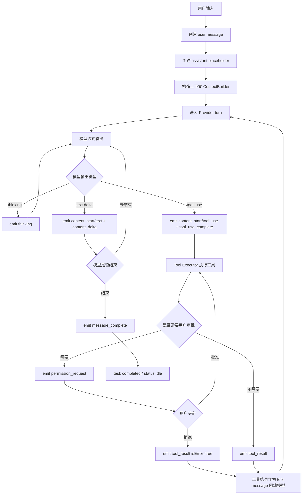
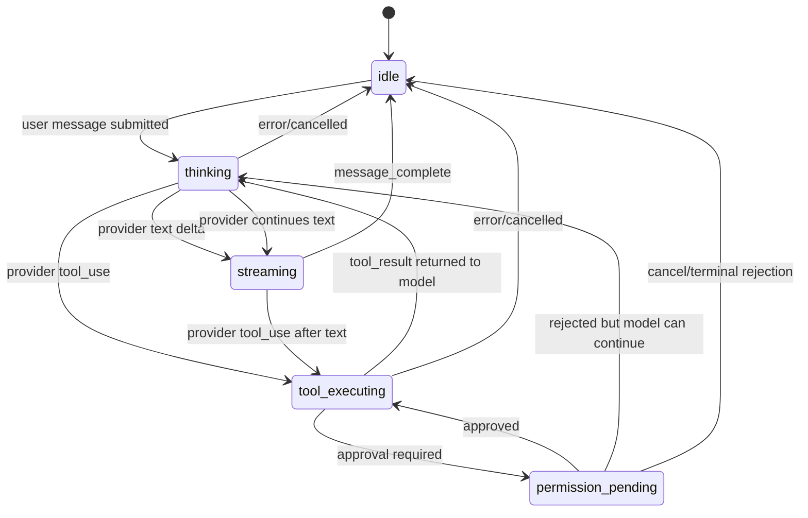
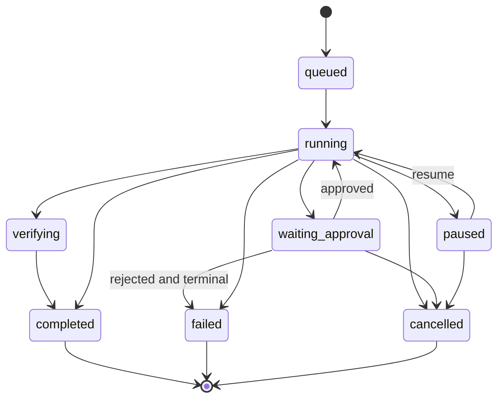
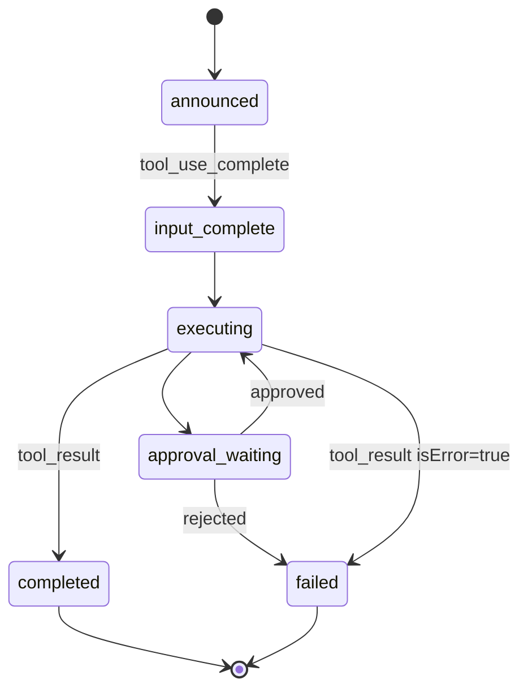
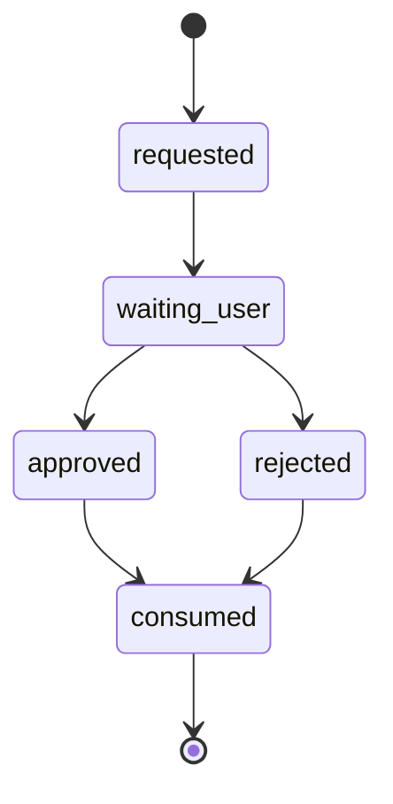
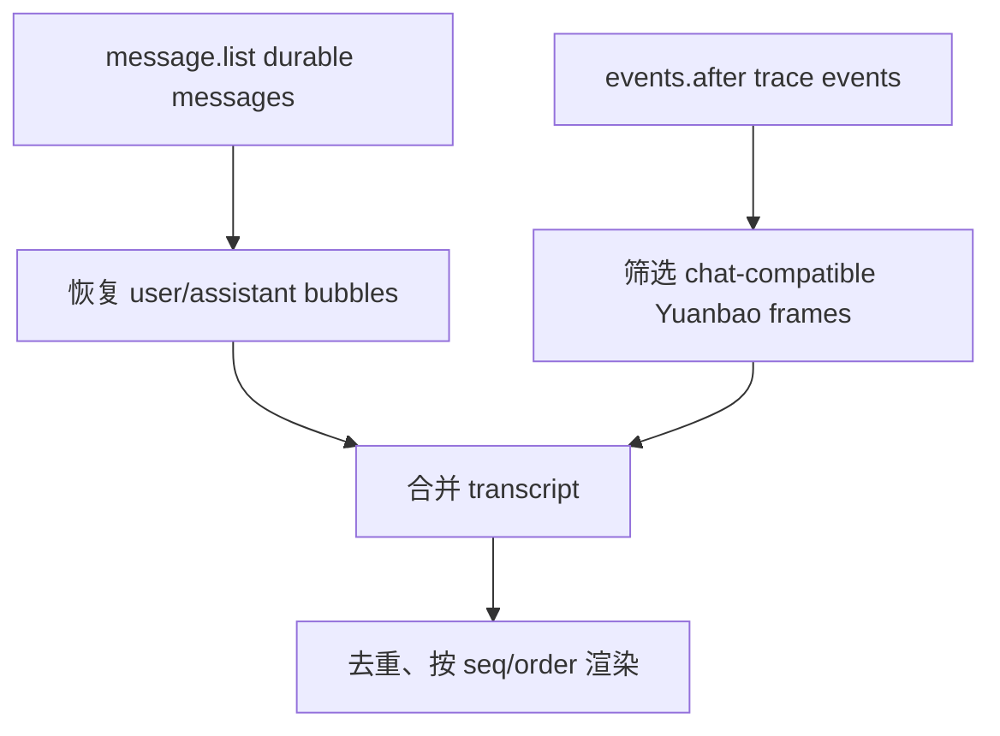

# Yuanbao 向 haha-cc 对齐：最终流程、状态机与当前差距

本文档定义 Yuanbao Agent 最终要对齐的 haha-cc / Claude Code 风格流程、状态机、输出分层，以及当前项目尚未完全满足的地方。

核心结论：

- Yuanbao 后端可以继续保留 task、trace、approval、worktree、multi-agent、memory、MCP 等能力。
- 用户主聊天流必须收敛为 haha-cc 风格的 typed conversation blocks。
- 后端复杂性只能进入 panel / trace / audit，不应伪装成聊天、thinking 或模型输出。
- 当前项目已经具备对齐骨架，但仍处在迁移期，还没有完全满足最终流程。
- 2026-06-09 起，当前生效基线是 model-first ReAct：普通完成不再经过 completion/advisor/evidence gate；`workspaceEvidenceRequired` 只作为诊断证据；历史 `completion_review` / `advisor_tool` approval 只做幂等忽略；新 flat 输出只消费 `event.yuanbao`，不再使用 `hahaCc` fallback。

## 1. 最终目标

最终用户看到的主流程应当是：

```text
用户消息
  -> 模型 thinking / 文本输出
  -> 模型 tool_use
  -> 工具执行
  -> tool_result 回填模型
  -> 模型继续 thinking / 文本输出
  -> message_complete
```

也就是说，主聊天区应只体现“模型和工具循环”的轨迹，而不是 RuntimeEvent 原始日志。

Yuanbao 可以比 haha-cc 后端更强，例如支持 worktree、hooks、memory、schedule、multi-agent，但这些能力必须通过结构化面板和 trace 展示，而不是污染主聊天流。

## 2. 最终输出分层

| 层级 | 目标 | 允许内容 | 不允许内容 |
| --- | --- | --- | --- |
| Chat protocol | 用户主聊天流 | `thinking`、`content_start`、`content_delta`、`tool_use_complete`、`tool_result`、`permission_request`、`message_complete`、`error` | router、advisor、provider diagnostics、raw task JSON、completion review JSON |
| Durable messages | 会话消息持久化 | user message、assistant final/streamed text、失败消息 | 重复的 trace projection、内部补充消息 |
| Runtime panel | 任务和运行时状态 | task status、plan、approval、worktree、changed files、commands、verification、multi-agent state | 普通 assistant 文本重复展示 |
| Trace / audit | 调试和审计 | raw RuntimeEvent、provider request/response、tool args/result、policy decision、context snapshot | 自动提升为 chat |
| Replay | 会话恢复 | 与 live 同规则的 chat-compatible frames | 比实时运行多出内部事件 |

## 3. 最终主流程



硬规则：

- 普通自然语言请求默认先进入模型，不应先由业务 router/advisor 生成计划或固定工具序列。
- 模型没有 tool call 时，应该直接完成为模型回答，而不是自动展开成 workspace probe。
- 工具由模型选择；规则/关键词最多作为 `intentHints` 或 tool policy 约束，不应抢占主流程。
- 工具结果必须回填给模型，由模型决定是否继续和如何总结。

## 4. 用户可见状态机

用户主聊天状态应收敛为以下状态：



状态含义：

| 状态 | 含义 | 典型协议帧 |
| --- | --- | --- |
| `idle` | 当前没有活跃输出 | `status(idle)` |
| `thinking` | 模型正在思考或等待首个输出 | `status(thinking)`、`thinking` |
| `streaming` | 模型正在输出文本 | `content_start(text)`、`content_delta(text)` |
| `tool_executing` | 可见工具正在执行 | `content_start(tool_use)`、`tool_use_complete`、`tool_result` |
| `permission_pending` | 等待用户批准真实风险操作 | `permission_request` |

## 5. 后端 Task 状态机

Yuanbao 后端仍需要 task 状态机，用于恢复、暂停、审计、队列和 panel 展示：



硬规则：

- `completed`、`failed`、`cancelled` 是吸收态。
- 任务进入终态后，迟到的 approval、completion review、tool result、resume 不能重新进入聊天流。
- task 状态可以更新 panel，但不应直接生成普通聊天文本。
- `task.failed` 可以更新任务面板；真正用户可见错误应由 `message.failed` 或 flat `error` 控制，避免双重 final error。

## 6. 工具状态机

每个可见工具块必须完整：



硬规则：

- 一个可见 `tool_use` 必须有且只有一个可见 `tool_result`。
- 工具失败、取消、超时、审批拒绝，也必须产生 error/cancelled `tool_result`。
- raw `tool.started`、`tool.completed`、`command.output` 可以进 trace，但主聊天应消费派生后的 `content_start/tool_use_complete/tool_result`。
- 工具 input/output 需要瘦身，避免完整 JSON 或超长 stdout 直接塞进聊天。

## 7. 审批状态机

审批只用于真实需要用户决策的行为：



硬规则：

- `apply_patch`、`write_file`、高风险 `run_command`、network、computer use、worktree merge 可以进入 `permission_request`。
- `completion_review` 是历史兼容/诊断记录，不是当前默认质量门；新任务不应创建它，也不应显示为聊天里的权限卡。
- 用户对 approval 或 `ask_user_question` 的回答属于当前 task supplement，不应成为新 user goal。
- 同一个 approval 不允许重复消费。

## 8. Replay 状态机

会话恢复应与 live 使用同一套可见性规则：



硬规则：

- durable assistant text 已经存在时，普通 `content_delta(text)` 不应从 trace 再回放一遍。
- tool block、permission、thinking、message_complete 可以从持久化 mirror 恢复。
- raw RuntimeEvent 不应因为 replay 而进入聊天。
- 取消后的迟到事件不应在重进会话时显示。

## 9. 当前已经满足的部分

当前项目已经具备以下基础：

- 已有 `YuanbaoServerMessage` 类型和 `hahaCc` 兼容别名。
- 已有 `YuanbaoEventAdapter`，可从 RuntimeEvent 投射 flat server message。
- 已有 `thinking`、`content_delta`、`tool_use_complete`、`tool_result`、`permission_request`、`message_complete` 等目标协议帧。
- 后端已具备 model-first ReAct 的主要路径。
- ProviderAdapter 支持 OpenAI Chat、OpenAI Responses、Anthropic Messages 兼容格式。
- RuntimeEvent、trace、provider_turn、context_snapshot、messages、tasks 已经持久化。
- 前端已有 `haha-clean` / `CleanSessionWorkspace` 这条更接近目标体验的 UI。
- 已经有 live event subscription 和 trace replay 相关逻辑。
- 权限系统、工具系统、worktree、多代理、MCP、skills、memory 等能力已经比较完整。

## 10. 当前不满足的地方

### 10.1 默认后端流已收敛为 model-first，但仍需防止旧策略回流

当前状态：

- 默认 `send_message` 已进入 model-first ReAct 路径，不再由 `MetaRouter`、`DecisionAdvisor` 或固定 planner/swarm 先决定业务流程。
- 旧 `router`、`decision_advisor`、固定 DAG planner/supervisor/swarm 模块已从生产路径移除。
- completion review 已退出默认完成路径，历史 `completion_review` approval 只允许被幂等忽略，不再恢复任务或成为新 goal。
- workspace evidence 只应来自显式契约，不应自动套到普通代码/文档任务。

剩余风险：

- provider recovery、completion evidence、tool policy 仍是运行时约束层，必须保持“约束模型工具可见性/记录 trace”，不能重新变成业务路由。
- 测试中只保留“旧 `plan_swarm` hint 不能重新开启固定编排”的防回归用例。

验收：

- 简单问答不会出现 task plan、advisor、workspace probe。
- 明确读写代码任务也应先由模型决定读哪些文件、用哪些工具。
- `rg` 生产路径中不应再出现 `MetaRouter`、`DecisionAdvisor`、`legacyPlanExecution` 等执行入口。

### 10.2 聊天流仍依赖过滤，而不是源头天然干净

问题：

- 当前仍需要 adapter 和前端过滤 `task.*`、`tool.*`、`command.*`、`system_notification` 等事件。
- 这说明源事件层和聊天协议层尚未彻底解耦。

期望：

- raw runtime event 默认只进 trace/panel。
- chat-compatible frame 由明确桥接事件产生，并带有稳定 `_bridge` / replay 标记。

验收：

- 主聊天区不出现 raw JSON、provider diagnostics、policy decision、completion review 内容。

### 10.3 工具块完整性还需要统一强约束

问题：

- 工具执行路径很多：普通工具、command background、approval、cancel、tool recovery、provider abort。
- 任一路径如果没有补齐 `tool_result`，前端和 replay 都可能出现孤儿工具块。

期望：

- 工具状态机集中化。
- 每个 visible `tool_use_complete` 必须登记 pending result。
- task terminal / cancel / failure 时统一 flush missing tool results。

验收：

- 成功、失败、超时、取消、审批拒绝都能看到唯一对应的 `tool_result`。

### 10.4 live 与 replay 仍有一致性风险

问题：

- 前端同时消费 durable messages、events.after、trace replay、Yuanbao frames。
- 如果去重或 visibility 规则不一致，重新打开会话会比 live 多显示内部事件或重复文本。

期望：

- live 和 replay 使用同一个 projection 函数和同一套 suppression 规则。
- normal assistant text 由 durable message 恢复；tool/thinking/permission 由 persisted mirror 恢复。

验收：

- 同一会话 live 截图与 reload 后主要聊天内容一致。
- 不重复 final text，不多出 raw task/provider/tool event。

### 10.5 审批和补充消息 ownership 未完全闭合

问题：

- approval answer、ask_user_question answer、active task supplement 可能被误当成新 goal。
- 同一审批重复提交或迟到提交可能扰乱终态 task。

期望：

- 所有内部响应都必须绑定 `taskId`、`approvalId` 或 `questionId`。
- consumed 后不可重复消费。
- terminal task 忽略迟到响应，并记录 trace。

验收：

- 用户批准后恢复原任务，不创建新用户目标。
- 用户拒绝后产生工具错误或任务终止，不出现第二条无关请求。

### 10.6 `completion_review` 已退出默认完成路径

问题：

- 旧流程曾把 completion review 当作内部质量门，导致 chat permission card、raw JSON 和审批后重复回答。
- 当前生产路径应把它视作历史兼容/诊断数据；新任务不应再由它阻塞、审查或恢复。

期望：

- normal completion 只由模型/工具循环结束决定；只要没有真实 pending approval/child runtime work，就直接完成。
- completion evidence 只进入 structured task data / panel / trace，不发布 `agent.decision.completion` 普通完成审查事件。
- 如果真的需要用户确认，必须来自真实权限/风险动作，并以明确产品动作命名，而不是内部 review JSON。
- 失败恢复应作为 `tool_result`/trace 回给模型，而不是由后端 advisor 自动生成 fallback/approval。

验收：

- 聊天区不出现 `completion_review` 权限卡。
- 新任务不创建 `completion_review` approval；历史 approval submit 幂等忽略。
- runtime panel 可以展示完成证据摘要，但不把它渲染成审批/审查流程。
- 工具失败后模型可以继续决定下一步，后端不抢占为隐藏恢复流程。

### 10.7 multi-agent / plan 输出仍可能模板化

问题：

- 复杂任务的 plan/swarm 子任务可能仍像固定模板。
- 子 agent 名称、task id、handoff metadata 有泄漏到用户界面的风险。

期望：

- 子任务标题和角色来自用户目标与仓库证据。
- 内部 id 保留在 metadata，不进入主要聊天文本。

验收：

- 多代理面板显示语义化角色和任务。
- 聊天区只显示必要的团队状态摘要或最终综合结果。

### 10.8 命名和 UI 仍处于迁移期

问题：

- `yuanbao`、`haha-clean`、旧 workbench 命名并存。
- 旧数据库中可能仍有 `hahaCc` 字段，但新事件、新补拉和新 replay 不应读取或生成它。

期望：

- 产品-facing 名称统一为 Yuanbao。
- 前端主消费路径只使用 `yuanbao_message` / `event.yuanbao`。
- `hahaCc` 只作为历史迁移术语保留在旧文档/负向断言中，不作为 fallback。

验收：

- 新代码不再新增 haha-cc 产品命名。
- 兼容字段有明确保留/移除计划。

## 11. P0 收敛任务

1. 固化 model-first ReAct 默认路径，并阻止旧 plan/router hint 回流。
2. 统一 chat projection：RuntimeEvent 到 Yuanbao frame 必须有单一权威函数。
3. 建立工具块完整性守卫：visible tool use 必须对应唯一 result。
4. 统一 live/replay 可见性规则。
5. 审批/补充消息加 ownership 和幂等消费。
6. 删除默认 completion/advisor/evidence gate；只保留真实权限和未完成 runtime work 的等待节点。
7. 清理主聊天中所有 raw JSON 和内部决策输出。
8. 将前端运行时卡片名称和展示语义从旧 routing/advisor 迁移到 provider/tool/task/team 语义。

## 12. 建议验收用例

### 12.1 简单问答

输入：

```text
你好，介绍一下这个项目。
```

期望：

- 不触发工具，除非模型主动请求。
- 不出现 task plan、routing、advisor、provider diagnostics。
- 聊天只显示模型文本和 `message_complete`。

### 12.2 只读代码分析

输入：

```text
分析 App.tsx 的主要职责，不要修改文件。
```

期望：

- 模型选择 read/search 工具。
- 工具块完整显示。
- 无写入工具、无写入审批。
- 最终回答来自模型综合。

### 12.3 写代码任务

输入：

```text
修复某个明确 bug，并运行相关测试。
```

期望：

- 模型先分析，再选择读文件/改文件/运行测试。
- 写文件或高风险命令按策略审批。
- 每个工具块有对应 result。
- 变更文件和测试结果进入 panel，聊天给清晰总结。

### 12.4 审批拒绝

输入：

```text
执行一个需要审批的写操作，然后拒绝审批。
```

期望：

- 显示一个 `permission_request`。
- 拒绝后产生 `tool_result isError=true` 或任务失败。
- 不创建新 user goal。

### 12.5 Reload replay

流程：

1. 跑一个包含工具和最终回答的任务。
2. 关闭/重新打开会话。

期望：

- reload 后聊天与 live 基本一致。
- 没有重复 final text。
- 没有 raw trace、routing、provider diagnostics 泄漏。

## 13. 最终判断标准

项目可以认为完成 haha-cc 方向对齐，当且仅当：

- 用户主聊天流看起来像模型和工具自然交替，而不是后端事件日志。
- live 和 replay 的可见内容一致。
- 工具块、审批块、错误块都有完整生命周期。
- 后端内部复杂能力仍可观测，但默认在 panel/trace，不进入聊天。
- 普通任务默认由模型优先驱动，规则系统只做约束和辅助。
