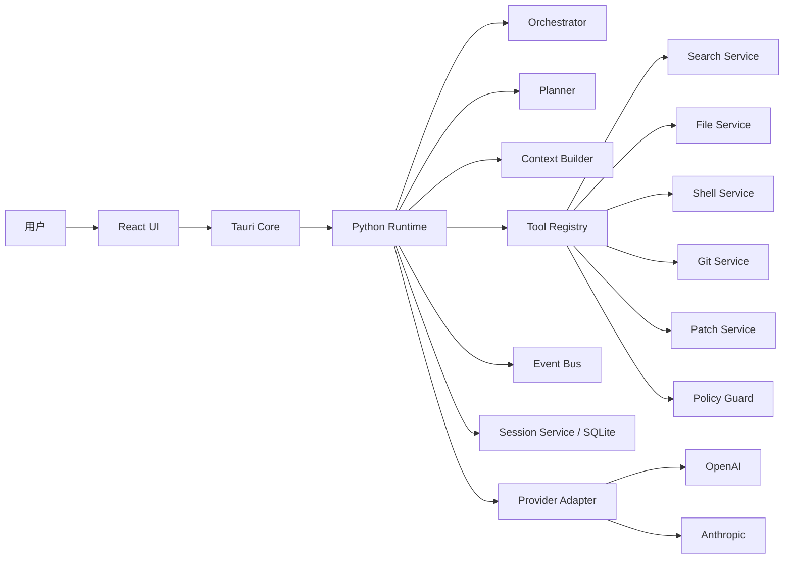
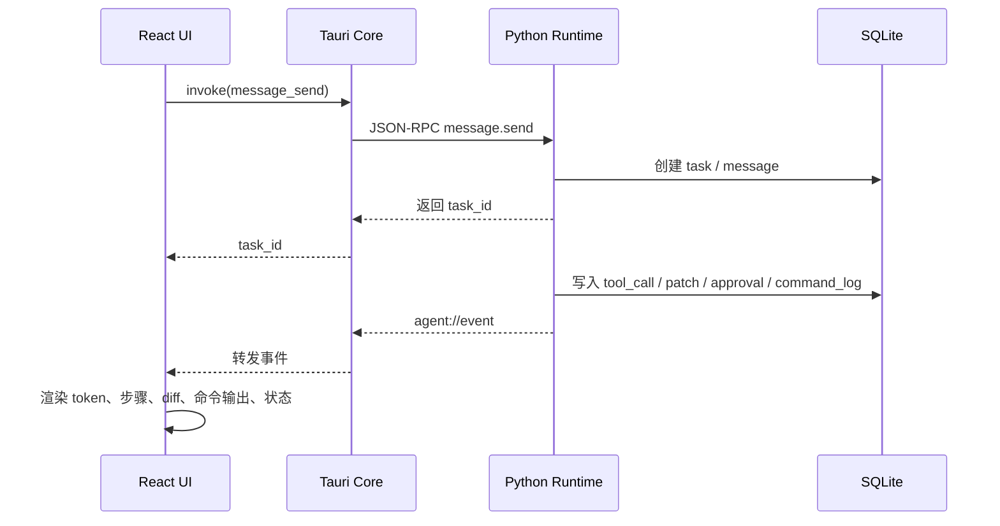
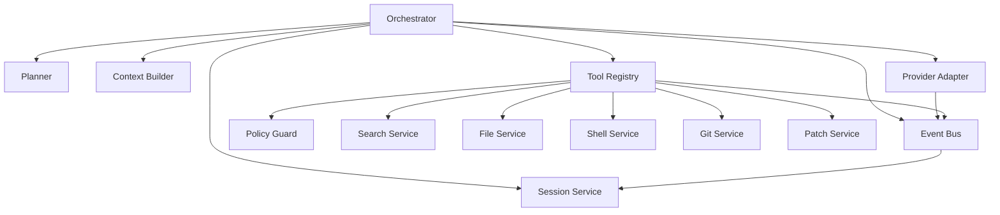

# 整体架构与核心技术栈

## 文档定位

本文基于 [local-ai-coding-agent-mvp-prd.md](D:\py\yuanbao_agent\docs\local-ai-coding-agent-mvp-prd.md) 与 [local-ai-coding-agent-mvp-tech-spec.md](D:\py\yuanbao_agent\docs\local-ai-coding-agent-mvp-tech-spec.md) 整理，面向本地桌面 AI 编程 Agent 的 MVP 阶段，给出高层技术方案。方案以“单用户、单机、本地工作区、可控闭环”为边界，不引入多租户、云端协作、多 Agent 编排、向量数据库等重型能力。

## 1. 架构目标与设计原则

### 1.1 架构目标

- 支撑本地代码仓库内的闭环开发流程：`搜索 -> 阅读 -> 计划 -> 修改 -> 验证 -> 审批 -> 落盘 -> 追溯`。
- 保证 Agent 行为可见、可控、可中断、可恢复，优先建立用户信任，而不是追求黑箱式全自动。
- 在 Windows 与 macOS 上提供一致的桌面体验，并兼容 Python / Node.js 等常见本地项目。
- 采用轻量、可演进的本地架构，为后续插件化、符号级理解、多模型路由预留扩展点。

### 1.2 设计原则

- 本地优先：工作区、会话、日志、配置、补丁与命令记录默认落本地。
- 单机单用户优先：MVP 先解决个人开发者的稳定闭环，不为协作场景过度设计。
- 分层解耦：前端、宿主、运行时、工具、存储、模型接入各自职责清晰。
- 事件驱动：长任务不走阻塞式同步返回，而是以 `task_id + event stream` 驱动 UI。
- 策略前置：路径边界、命令风险、审批模式、超时与步数限制在工具执行前生效。
- Patch First：所有写操作优先以 `diff/patch` 形式表达，避免整文件黑箱覆盖。
- Schema First：IPC、JSON-RPC、工具参数、事件 envelope、错误码统一结构化定义。
- 可恢复优先：任务、补丁、命令输出、审批决策均持久化，支持异常退出后的恢复与追溯。

## 2. 总体架构分层

### 2.1 分层说明

- 表现层：`React + TypeScript`，负责会话 UI、任务状态、Diff 展示、命令输出、审批交互、设置页。
- 宿主层：`Tauri Rust Core`，作为前端可信网关，负责窗口与系统能力、IPC 校验、路径边界校验、Sidecar 生命周期管理、事件转发。
- 运行时层：`Python sidecar`，负责 Agent 编排、上下文构建、工具调度、模型接入、状态推进与本地持久化。
- 工具执行层：文件、搜索、Shell、Git、Patch 等工具服务，以及统一的 `Policy Guard` 风险控制。
- 存储与外部接入层：`SQLite` 作为核心元数据存储，文件系统承载工作区与大输出文件，模型 Provider 通过适配器统一接入。

### 2.2 高层架构图

### 2.3 分层边界

- React 不直接调用底层工具，只调用业务级命令。
- Tauri 不承担业务编排，只负责宿主能力、校验与安全边界。
- Python Runtime 不直接暴露给前端，只经由 Tauri 转发。
- 工具服务不直接操作 UI，也不直接决定审批策略，由 `Orchestrator + Policy Guard` 统一协调。
- SQLite 保存业务事实，文件系统保存工作区内容与大块输出，二者职责分离。

## 3. 请求链路与事件链路

### 3.1 请求链路

用户发起任务时，链路遵循“同步受理、异步执行、事件回传”的模式：

1. 用户在 React UI 输入任务或审批动作。
2. React 通过 Tauri `invoke` 发起业务请求，如 `message_send`、`approval_submit`。
3. Tauri 校验参数、检查路径/权限边界，必要时补充宿主上下文。
4. Tauri 将请求转换为 `JSON-RPC 2.0 over stdio`，发送给 Python Runtime。
5. Python Runtime 创建或推进 `task`，写入 SQLite，并立即返回 `task_id`。
6. 后续模型调用、工具执行、补丁生成、审批等待、验证结果均通过事件流回传。

### 3.2 事件链路

运行过程采用统一事件总线，从 Runtime 单向流向前端：

### 3.3 两类关键事件

- 请求类结果：`task.queued`、`task.started`、`task.waiting_approval`、`task.completed`、`task.failed`。
- 流式过程事件：`assistant.token`、`tool.started`、`tool.completed`、`command.output`、`patch.proposed`、`approval.requested`。

### 3.4 关键控制点

- 审批是显式任务状态，而不是前端私有弹窗逻辑。
- 取消任务由用户显式触发，Tauri 与 Runtime 必须支持中断模型调用和子进程。
- 所有长流程都要求可重放、可恢复，因此任务态变化与关键事件必须持久化。

## 4. 核心运行时模块关系

### 4.1 模块职责

- `orchestrator`：任务主控，驱动 Agent Loop，协调“规划、上下文、模型、工具、审批、验证、结束”。
- `planner`：将复杂目标转为结构化步骤，供 UI 展示和运行时参考。
- `context_builder`：汇总最近消息、已读文件、搜索命中、命令输出、关键配置文件，并做 token 预算控制。
- `provider_adapter`：屏蔽不同模型供应商的接口差异，统一消息格式、工具调用格式与流式回调。
- `tool_registry`：维护工具 schema、参数校验、调用分发。
- `tool_services`：实际执行 `search/file/shell/git/patch` 等能力。
- `policy_guard`：对路径越界、危险命令、网络访问、超时、步数、文件变更数进行门控。
- `session_service`：负责 `sessions/messages/tasks/tool_calls/patches/command_logs/approvals/config` 等读写。
- `event_bus`：统一内部事件结构，广播给持久化层和 Tauri 事件桥。

### 4.2 模块协作关系

### 4.3 运行时主循环

- 接收用户目标并创建 `task`。
- 构建上下文并请求模型生成计划或下一步动作。
- 若模型要求工具调用，则先经 `policy_guard` 判定风险，再由 `tool_registry` 分发。
- 若产出补丁，则先生成 `patch` 记录并触发审批。
- 审批通过后应用补丁，并运行验证命令。
- 若验证失败，则将失败日志回灌给 `context_builder`，执行至少一轮自动修复。
- 所有状态推进统一通过 `event_bus` 广播，并同步写入 SQLite。

## 5. 数据存储策略

### 5.1 存储总体策略

- `SQLite` 作为 MVP 单机主存储，保存所有结构化业务数据与审计轨迹。
- 本地文件系统保存工作区原文件、命令 stdout/stderr 大输出、必要的缓存文件。
- 不引入 Redis、对象存储、向量数据库、工作流引擎等额外基础设施。

### 5.2 结构化数据分层

- 工作区层：`workspaces`，定义工作区根目录与身份。
- 会话层：`sessions`、`messages`，承载历史对话和摘要。
- 任务层：`tasks`，是所有长流程的统一主键与状态机载体。
- 执行层：`tool_calls`、`command_logs`，记录工具与命令执行事实。
- 变更层：`patches`，记录待审批、已应用、已拒绝的代码变更。
- 安全层：`approvals`，记录审批请求与决策。
- 配置层：`config_entries`，支持 `global > workspace > session` 覆盖。
- 记忆层：`memories`，作为后续增强的轻量记忆入口，MVP 不做复杂检索。

### 5.3 写入策略

- 任务启动先写 `tasks`，再写相关事件和执行记录，保证可追溯。
- `patch` 先以 `dry-run` 或提案形式入库，再进入审批与应用阶段。
- 命令实时输出走事件流，结束后将摘要与输出文件路径落 `command_logs`。
- 关键状态变化应幂等写入，避免异常重试造成数据歧义。

### 5.4 恢复与清理

- 应用异常退出后，以 `tasks`、`patches`、`command_logs` 重建最近执行现场。
- 会话恢复不要求恢复到进程级精确点，但要求恢复到“用户可理解、可继续”的最近稳定状态。
- 提供会话、日志、配置的本地清理能力，满足隐私和磁盘治理需求。

## 6. 安全边界

### 6.1 信任边界划分

- 用户交互边界：React 只负责展示与输入，不直接拥有系统级能力。
- 宿主边界：Tauri 是前端与本地系统之间的可信闸门。
- 运行时边界：Python Runtime 负责业务执行，但其输入输出必须经过宿主校验与策略限制。
- 外部服务边界：模型 Provider 是唯一默认允许接触外部的远程依赖，其他联网工具默认关闭。

### 6.2 文件系统边界

- 默认可读写范围仅限当前工作区。
- 所有路径在 Tauri 与 Python 两层做归一化和越界检查。
- 工作区外路径访问默认拒绝，或进入审批。
- 删除、批量写入、跨目录写入视为高风险操作。

### 6.3 命令执行边界

- 命令执行 `cwd` 默认绑定工作区。
- 低风险命令可在宽松模式自动执行，高风险命令必须审批。
- 必须具备超时、强制终止、输出截断、危险模式拦截能力。
- 命令策略应支持黑名单与有限白名单并存，避免仅靠字符串匹配形成假安全。

### 6.4 数据与隐私边界

- 会话、日志、补丁、配置默认本地保存。
- 本地项目内容不自动上传到除模型 API 外的第三方服务。
- API Key 不应进入会话消息和任务日志，建议由宿主层托管在本地安全存储中。
- 所有联网行为都应有清晰可见的开关与提示。

### 6.5 审批边界

- 审批模式至少支持：全审批、风险审批、宽松模式。
- 审批对象至少覆盖：写文件、运行命令、删除文件、网络访问。
- 审批决策必须结构化记录，便于追溯与后续策略优化。

## 7. 核心技术栈选型与选型理由

| 领域 | 选型 | 选型理由 |
| --- | --- | --- |
| 桌面宿主 | `Tauri + Rust` | 跨平台、资源占用低、宿主能力强，适合作为可信安全边界；相比重型桌面壳更利于本地工具型产品。 |
| 前端界面 | `React + TypeScript` | 适合构建聊天流、事件流、Diff 视图、任务时间线等复杂交互；类型系统有利于事件与状态建模。 |
| Agent Runtime | `Python sidecar` | Python 在 Agent 编排、模型接入、文本处理、命令工具生态上成熟，适合快速迭代 MVP。 |
| 宿主到 Runtime 通信 | `JSON-RPC 2.0 over stdio` | 不暴露本地端口，协议简单、结构清晰、易于调试，天然适合本地 sidecar 进程通信。 |
| 前端到宿主通信 | `Tauri invoke + listen` | 与桌面端交互模型天然匹配，分别承担命令请求与事件订阅。 |
| 主存储 | `SQLite` | 嵌入式、零运维、事务可靠、便于 schema migration，非常适合单机单用户 MVP。 |
| 代码搜索 | `ripgrep` | 对中小型代码仓库搜索性能高，适合作为默认全文检索能力。 |
| 代码修改表达 | `Unified Diff / Patch` | 便于审批、展示、回滚和 Git 对齐，符合“可审查”的核心产品诉求。 |
| 源码状态观测 | `Git CLI` | 与开发者日常工作流一致，可直接提供状态、diff、回滚基线。 |
| 模型接入 | `Provider Adapter` 统一接 OpenAI / Anthropic | 屏蔽供应商差异，降低未来替换成本，同时避免 MVP 早期做复杂多模型调度。 |
| 事件模型 | 统一 `event envelope` | 保证 UI、日志、持久化、调试口径一致，降低状态同步复杂度。 |

### 7.1 明确不选型的部分

- 不选 `Electron` 作为首选宿主，原因是 MVP 更关注轻量、边界清晰与资源占用。
- 不引入 `Redis / Temporal / Qdrant`，原因是当前单机闭环不需要分布式队列、工作流引擎或向量检索。
- 不做多 Agent 编排框架，原因是会显著抬高状态管理、调试和用户理解成本。

## 8. 演进路线

### 8.1 阶段一：打通最小链路

目标是形成“可用的本地聊天与工具壳”。

- 打通 `React -> Tauri -> Python` 请求链路与事件链路。
- 建立 `workspace / session / message / task` 最小数据模型。
- 落地 `list_dir / search_files / read_file / run_command` 基础工具。
- 支持流式回复、历史会话查看与恢复。

### 8.2 阶段二：形成代码修改闭环

目标是形成“可审查的代码修改能力”。

- 引入 `apply_patch / diff / approval / git_status / git_diff`。
- 完成补丁提案、Diff 展示、审批、写回工作区。
- 建立统一任务状态机和命令日志。
- 让所有写操作都可追溯、可拒绝、可回滚。

### 8.3 阶段三：形成自动验证与错误恢复

目标是形成“修改后可验证、失败后可再修”的执行闭环。

- 支持验证命令自动执行。
- 将失败日志回灌给模型，完成至少一轮自动修复。
- 完成任务取消、中断、超时控制与稳定恢复。
- 增强错误模型、重试策略与事件可观测性。

### 8.4 阶段四：增强代码理解与扩展能力

目标是提升质量，而不是简单堆功能。

- 增加关键配置文件优先读取、忽略规则、会话摘要、偏好配置。
- 增加符号级理解能力，如基于 LSP 或 tree-sitter 的定义/引用定位。
- 增加浏览器自动化验证，服务前端项目调试。
- 引入工具插件系统 / MCP 接入，但仍保持宿主层的统一安全门控。

### 8.5 阶段五：进阶能力演进

在单机稳定后，再考虑能力外扩。

- 多模型路由与成本/延迟策略。
- 轻量长期记忆与项目规范沉淀。
- 本地知识库与向量检索。
- 多 Agent 协作，但需建立更强的任务可视化、资源预算和调试机制。

## 结论

该方案的核心不是“把模型接进桌面应用”，而是围绕本地开发场景构建一个可信、可审查、可恢复的执行系统。`React + Tauri + Python + SQLite` 的组合满足 MVP 对本地优先、快速迭代、跨平台、可控安全边界的要求；而 `JSON-RPC over stdio + 统一事件流 + Patch First + Policy Guard` 则构成整个系统的关键工程骨架。后续演进应继续坚持“先闭环、后增强；先可控、后智能”的路线。
