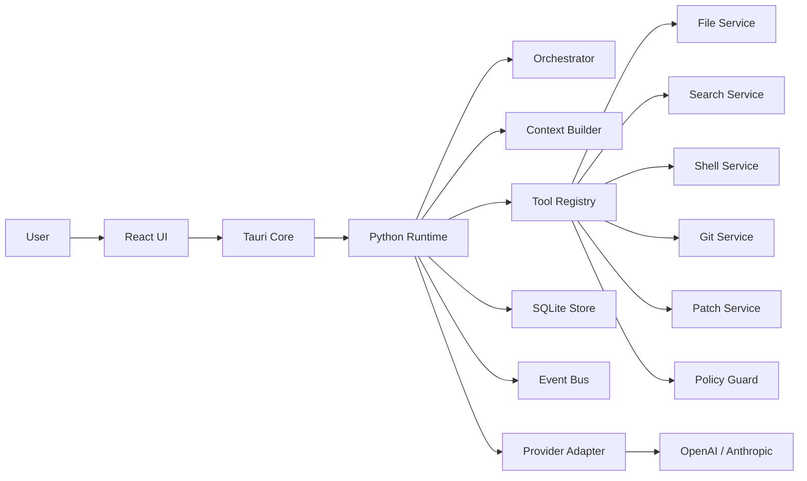

# 本地桌面 AI 编程 Agent MVP 技术规格

## 1. 范围与假设

- 前端：`Tauri + React + TypeScript`
- 本地宿主：`Tauri Rust Core`
- Runtime：`Python sidecar`
- 存储：`SQLite`
- 通信原则：
  - `React -> Tauri`：Tauri `invoke` + `listen`
  - `Tauri -> Python Runtime`：`JSON-RPC 2.0 over stdio`
  - 流式事件：`Python -> Tauri -> React` 转发统一事件流
- 目标：支持单用户、单机、本地工作区内的编程 Agent MVP

---

## 2. 前后端边界

### 2.1 React 前端职责

- 会话 UI、任务步骤 UI、Diff UI、命令输出 UI、设置页
- 用户输入采集与展示
- 发起高层动作请求：
  - 打开工作区
  - 创建会话
  - 发送用户消息
  - 审批补丁 / 命令
  - 查询历史
- 订阅事件流并渲染：
  - agent token
  - tool 调用状态
  - shell 输出
  - diff 生成
  - task 状态

### 2.2 Tauri Core 职责

- 前端可信网关
- 管理 Python runtime sidecar 生命周期
- 做 IPC 参数校验、权限校验、路径边界校验
- 维护前端订阅的事件总线
- 处理本地文件选择、原生窗口、系统权限等宿主能力
- 将前端请求转发为 Python JSON-RPC

### 2.3 Python Runtime 职责

- Agent 编排
- 上下文构建
- 工具调度
- SQLite 持久化
- shell / git / search / patch 执行
- 事件生成与状态推进

---

## 3. 总体架构



---

## 4. 本地 IPC / API 设计

### 4.1 React -> Tauri 命令

建议命令名：

- `workspace_open(path)`
- `session_create(payload)`
- `session_get(session_id)`
- `session_list()`
- `message_send(payload)`
- `task_get(task_id)`
- `task_cancel(task_id)`
- `approval_submit(payload)`
- `config_get()`
- `config_update(payload)`
- `diff_get(patch_id)`
- `command_log_get(command_id)`

### 4.2 Tauri -> Python JSON-RPC 方法

统一 envelope：

```json
{
  "jsonrpc": "2.0",
  "id": "req_123",
  "method": "message.send",
  "params": {}
}
```

建议方法：

- `workspace.open`
- `session.create`
- `session.get`
- `session.list`
- `message.send`
- `task.get`
- `task.cancel`
- `approval.submit`
- `config.get`
- `config.update`
- `diff.get`
- `command_log.get`

### 4.3 设计原则

- 前端只调用业务级 API，不直接触碰底层工具。
- 工具调用只允许 Python runtime 内部发起。
- 所有长任务必须异步返回 `task_id`。
- 所有实时过程通过事件流返回，不通过轮询拼接。

---

## 5. Runtime 模块边界

### 5.1 `orchestrator`

- 接收用户消息
- 创建 task
- 驱动 agent loop
- 决定是否进入工具调用、审批等待、验证、结束

### 5.2 `planner`

- 对复杂任务生成 plan steps
- 输出结构化计划，供 UI 展示和后续执行参考

### 5.3 `context_builder`

- 收集上下文：
  - 最近消息摘要
  - 已读文件片段
  - 搜索结果
  - 最近命令输出
  - 关键项目配置文件
- 控制 token 预算

### 5.4 `tool_registry`

- 注册工具 schema
- 执行参数校验
- 分发到具体工具实现

### 5.5 `tool_services`

- `search_service`
- `file_service`
- `patch_service`
- `shell_service`
- `git_service`

### 5.6 `policy_guard`

- 路径越界检查
- 命令黑白名单
- 审批门控
- 超时 / 步数 / token / 文件修改数限制

### 5.7 `provider_adapter`

- 统一对接 OpenAI / Anthropic
- 统一消息格式、工具调用格式、流式 token 回调

### 5.8 `session_service`

- 会话、消息、任务、补丁、命令日志读写

### 5.9 `event_bus`

- 统一内部事件对象
- 持久化关键事件
- 转发到 Tauri 再到前端

---

## 6. 任务状态机

### 6.1 `tasks.status`

- `queued`
- `running`
- `waiting_approval`
- `completed`
- `failed`
- `cancelled`

### 6.2 状态流转

```text
queued -> running -> waiting_approval -> running -> completed
queued -> running -> failed
queued -> running -> cancelled
queued -> waiting_approval -> cancelled
```

### 6.3 原则

- 所有长流程都必须归属一个 `task`。
- 审批是 task 的显式阻塞态，不是隐式弹窗。
- `cancelled` 必须可由用户主动触发。

---

## 7. SQLite Schema

### 7.1 `workspaces`

| 字段 | 类型 | 说明 |
| --- | --- | --- |
| `id` | `TEXT PK` | 工作区 ID |
| `name` | `TEXT NOT NULL` | 工作区名称 |
| `root_path` | `TEXT NOT NULL UNIQUE` | 根目录 |
| `created_at` | `INTEGER NOT NULL` | 创建时间 |
| `updated_at` | `INTEGER NOT NULL` | 更新时间 |

索引：

- `idx_workspaces_root_path(root_path)`

### 7.2 `sessions`

| 字段 | 类型 | 说明 |
| --- | --- | --- |
| `id` | `TEXT PK` | 会话 ID |
| `workspace_id` | `TEXT NOT NULL` | 所属工作区 |
| `title` | `TEXT` | 会话标题 |
| `status` | `TEXT NOT NULL` | `active|archived|failed` |
| `summary` | `TEXT` | 会话摘要 |
| `created_at` | `INTEGER NOT NULL` | 创建时间 |
| `updated_at` | `INTEGER NOT NULL` | 更新时间 |

索引：

- `idx_sessions_workspace_updated(workspace_id, updated_at DESC)`

### 7.3 `messages`

| 字段 | 类型 | 说明 |
| --- | --- | --- |
| `id` | `TEXT PK` | 消息 ID |
| `session_id` | `TEXT NOT NULL` | 所属会话 |
| `role` | `TEXT NOT NULL` | `user|assistant|system|tool` |
| `content_json` | `TEXT NOT NULL` | 结构化消息内容 |
| `token_count` | `INTEGER` | Token 数 |
| `created_at` | `INTEGER NOT NULL` | 创建时间 |

索引：

- `idx_messages_session_created(session_id, created_at ASC)`

### 7.4 `tasks`

| 字段 | 类型 | 说明 |
| --- | --- | --- |
| `id` | `TEXT PK` | 任务 ID |
| `session_id` | `TEXT NOT NULL` | 所属会话 |
| `type` | `TEXT NOT NULL` | `chat|plan|edit|validate` |
| `status` | `TEXT NOT NULL` | `queued|running|waiting_approval|completed|failed|cancelled` |
| `goal` | `TEXT NOT NULL` | 用户目标 |
| `plan_json` | `TEXT` | 结构化计划 |
| `result_json` | `TEXT` | 任务结果 |
| `error_code` | `TEXT` | 错误码 |
| `created_at` | `INTEGER NOT NULL` | 创建时间 |
| `updated_at` | `INTEGER NOT NULL` | 更新时间 |

索引：

- `idx_tasks_session_updated(session_id, updated_at DESC)`
- `idx_tasks_status(status)`

### 7.5 `tool_calls`

| 字段 | 类型 | 说明 |
| --- | --- | --- |
| `id` | `TEXT PK` | Tool call ID |
| `task_id` | `TEXT NOT NULL` | 所属任务 |
| `tool_name` | `TEXT NOT NULL` | 工具名 |
| `arguments_json` | `TEXT NOT NULL` | 调用参数 |
| `status` | `TEXT NOT NULL` | `started|completed|failed` |
| `result_json` | `TEXT` | 调用结果 |
| `error_json` | `TEXT` | 错误详情 |
| `started_at` | `INTEGER NOT NULL` | 开始时间 |
| `finished_at` | `INTEGER` | 结束时间 |

索引：

- `idx_tool_calls_task_started(task_id, started_at ASC)`

### 7.6 `patches`

| 字段 | 类型 | 说明 |
| --- | --- | --- |
| `id` | `TEXT PK` | Patch ID |
| `task_id` | `TEXT NOT NULL` | 所属任务 |
| `workspace_id` | `TEXT NOT NULL` | 所属工作区 |
| `summary` | `TEXT` | 补丁摘要 |
| `diff_text` | `TEXT NOT NULL` | Unified diff |
| `status` | `TEXT NOT NULL` | `proposed|approved|applied|rejected|failed` |
| `files_changed` | `INTEGER NOT NULL` | 变更文件数 |
| `created_at` | `INTEGER NOT NULL` | 创建时间 |
| `updated_at` | `INTEGER NOT NULL` | 更新时间 |

索引：

- `idx_patches_task_created(task_id, created_at DESC)`
- `idx_patches_status(status)`

### 7.7 `command_logs`

| 字段 | 类型 | 说明 |
| --- | --- | --- |
| `id` | `TEXT PK` | 命令 ID |
| `task_id` | `TEXT NOT NULL` | 所属任务 |
| `command` | `TEXT NOT NULL` | 命令内容 |
| `cwd` | `TEXT NOT NULL` | 运行目录 |
| `exit_code` | `INTEGER` | 退出码 |
| `status` | `TEXT NOT NULL` | `running|completed|failed|timeout|killed` |
| `stdout_path` | `TEXT` | stdout 存储路径 |
| `stderr_path` | `TEXT` | stderr 存储路径 |
| `started_at` | `INTEGER NOT NULL` | 开始时间 |
| `finished_at` | `INTEGER` | 结束时间 |

索引：

- `idx_command_logs_task_started(task_id, started_at DESC)`

### 7.8 `approvals`

| 字段 | 类型 | 说明 |
| --- | --- | --- |
| `id` | `TEXT PK` | 审批 ID |
| `task_id` | `TEXT NOT NULL` | 所属任务 |
| `kind` | `TEXT NOT NULL` | `apply_patch|run_command|delete_file|network_access` |
| `request_json` | `TEXT NOT NULL` | 审批请求内容 |
| `decision` | `TEXT` | `approved|rejected` |
| `decided_by` | `TEXT` | 决策者 |
| `created_at` | `INTEGER NOT NULL` | 创建时间 |
| `decided_at` | `INTEGER` | 决策时间 |

索引：

- `idx_approvals_task_created(task_id, created_at DESC)`
- `idx_approvals_pending(decision, created_at)`

### 7.9 `config_entries`

| 字段 | 类型 | 说明 |
| --- | --- | --- |
| `key` | `TEXT PK` | 配置键 |
| `value_json` | `TEXT NOT NULL` | 配置值 |
| `updated_at` | `INTEGER NOT NULL` | 更新时间 |

### 7.10 `memories`

| 字段 | 类型 | 说明 |
| --- | --- | --- |
| `id` | `TEXT PK` | 记忆 ID |
| `workspace_id` | `TEXT` | 可选工作区范围 |
| `scope` | `TEXT NOT NULL` | `global|workspace|session` |
| `content` | `TEXT NOT NULL` | 记忆内容 |
| `source` | `TEXT` | 来源 |
| `created_at` | `INTEGER NOT NULL` | 创建时间 |
| `updated_at` | `INTEGER NOT NULL` | 更新时间 |

索引：

- `idx_memories_scope_workspace(scope, workspace_id, updated_at DESC)`

---

## 8. Core Tool Schema

统一结构：

```json
{
  "name": "tool_name",
  "description": "tool purpose",
  "input_schema": {
    "type": "object",
    "properties": {},
    "required": []
  }
}
```

### 8.1 `search_files`

```json
{
  "name": "search_files",
  "description": "按文本或文件名在工作区内搜索",
  "input_schema": {
    "type": "object",
    "properties": {
      "workspace_id": { "type": "string" },
      "query": { "type": "string" },
      "mode": { "type": "string", "enum": ["content", "filename"] },
      "glob": { "type": "string" },
      "max_results": { "type": "integer", "minimum": 1, "maximum": 200 }
    },
    "required": ["workspace_id", "query", "mode"]
  }
}
```

### 8.2 `read_file`

```json
{
  "name": "read_file",
  "description": "读取完整文件，适合小文件",
  "input_schema": {
    "type": "object",
    "properties": {
      "workspace_id": { "type": "string" },
      "path": { "type": "string" },
      "encoding": { "type": "string", "default": "utf-8" },
      "max_bytes": { "type": "integer", "minimum": 1 }
    },
    "required": ["workspace_id", "path"]
  }
}
```

### 8.3 `read_file_range`

```json
{
  "name": "read_file_range",
  "description": "按行号读取文件片段",
  "input_schema": {
    "type": "object",
    "properties": {
      "workspace_id": { "type": "string" },
      "path": { "type": "string" },
      "start_line": { "type": "integer", "minimum": 1 },
      "end_line": { "type": "integer", "minimum": 1 }
    },
    "required": ["workspace_id", "path", "start_line", "end_line"]
  }
}
```

### 8.4 `apply_patch`

```json
{
  "name": "apply_patch",
  "description": "应用 unified diff 补丁",
  "input_schema": {
    "type": "object",
    "properties": {
      "workspace_id": { "type": "string" },
      "diff": { "type": "string" },
      "dry_run": { "type": "boolean", "default": false }
    },
    "required": ["workspace_id", "diff"]
  }
}
```

### 8.5 `write_file`

```json
{
  "name": "write_file",
  "description": "创建或覆盖文件，通常只用于新文件或小文件输出",
  "input_schema": {
    "type": "object",
    "properties": {
      "workspace_id": { "type": "string" },
      "path": { "type": "string" },
      "content": { "type": "string" },
      "overwrite": { "type": "boolean", "default": false }
    },
    "required": ["workspace_id", "path", "content"]
  }
}
```

### 8.6 `list_dir`

```json
{
  "name": "list_dir",
  "description": "列出目录内容",
  "input_schema": {
    "type": "object",
    "properties": {
      "workspace_id": { "type": "string" },
      "path": { "type": "string" },
      "recursive": { "type": "boolean", "default": false },
      "max_depth": { "type": "integer", "minimum": 1, "maximum": 8 }
    },
    "required": ["workspace_id", "path"]
  }
}
```

### 8.7 `run_command`

```json
{
  "name": "run_command",
  "description": "在工作区内执行命令",
  "input_schema": {
    "type": "object",
    "properties": {
      "workspace_id": { "type": "string" },
      "command": { "type": "string" },
      "cwd": { "type": "string" },
      "timeout_ms": { "type": "integer", "minimum": 1000, "maximum": 1800000 },
      "env": { "type": "object", "additionalProperties": { "type": "string" } }
    },
    "required": ["workspace_id", "command"]
  }
}
```

### 8.8 `git_status`

```json
{
  "name": "git_status",
  "description": "读取 git 状态",
  "input_schema": {
    "type": "object",
    "properties": {
      "workspace_id": { "type": "string" }
    },
    "required": ["workspace_id"]
  }
}
```

### 8.9 `git_diff`

```json
{
  "name": "git_diff",
  "description": "读取 git diff",
  "input_schema": {
    "type": "object",
    "properties": {
      "workspace_id": { "type": "string" },
      "target": { "type": "string", "enum": ["working_tree", "staged", "commit"] },
      "commit_ref": { "type": "string" },
      "pathspec": { "type": "string" }
    },
    "required": ["workspace_id", "target"]
  }
}
```

---

## 9. 代表性请求 / 响应 JSON

### 9.1 创建会话

请求：

```json
{
  "title": "修复 pytest 失败",
  "workspace_id": "ws_001"
}
```

响应：

```json
{
  "session_id": "sess_001",
  "status": "active",
  "created_at": 1770000000
}
```

### 9.2 发送消息

请求：

```json
{
  "session_id": "sess_001",
  "content": "帮我修复当前项目失败的单测，先跑测试再修改代码。",
  "attachments": []
}
```

响应：

```json
{
  "task_id": "task_001",
  "status": "queued"
}
```

### 9.3 `search_files` 工具结果

```json
{
  "tool_call_id": "tc_001",
  "tool_name": "search_files",
  "status": "completed",
  "result": {
    "matches": [
      {
        "path": "tests/test_auth.py",
        "line": 42,
        "preview": "assert login(user) == ..."
      }
    ],
    "total": 1
  }
}
```

### 9.4 `read_file_range` 工具结果

```json
{
  "tool_call_id": "tc_002",
  "tool_name": "read_file_range",
  "status": "completed",
  "result": {
    "path": "src/auth.py",
    "start_line": 1,
    "end_line": 80,
    "content": "def login(...):\n    ..."
  }
}
```

### 9.5 `apply_patch` dry-run

请求：

```json
{
  "workspace_id": "ws_001",
  "diff": "--- a/src/auth.py\n+++ b/src/auth.py\n@@ ...",
  "dry_run": true
}
```

响应：

```json
{
  "ok": true,
  "files_changed": 1,
  "patch_id": "patch_001",
  "summary": "修复 login 返回值判定逻辑"
}
```

### 9.6 审批提交

请求：

```json
{
  "approval_id": "appr_001",
  "decision": "approved"
}
```

响应：

```json
{
  "approval_id": "appr_001",
  "task_id": "task_001",
  "status": "accepted"
}
```

---

## 10. 事件流模型

### 10.1 事件信道

- Tauri 事件名统一为：`agent://event`
- 前端按 `session_id` / `task_id` 过滤

### 10.2 统一事件 envelope

```json
{
  "event_id": "evt_001",
  "session_id": "sess_001",
  "task_id": "task_001",
  "type": "tool.started",
  "ts": 1770000001,
  "payload": {}
}
```

### 10.3 事件类型

- `task.queued`
- `task.started`
- `task.updated`
- `task.waiting_approval`
- `task.completed`
- `task.failed`
- `assistant.token`
- `assistant.message.completed`
- `tool.started`
- `tool.completed`
- `tool.failed`
- `command.output`
- `patch.proposed`
- `approval.requested`
- `approval.resolved`

### 10.4 关键事件 payload 示例

`assistant.token`

```json
{
  "delta": "正在运行 pytest ..."
}
```

`tool.started`

```json
{
  "tool_call_id": "tc_003",
  "tool_name": "run_command",
  "arguments": {
    "command": "pytest -q"
  }
}
```

`command.output`

```json
{
  "command_id": "cmd_001",
  "stream": "stdout",
  "chunk": "F....\n"
}
```

`patch.proposed`

```json
{
  "patch_id": "patch_001",
  "summary": "修复 login 判定逻辑",
  "files_changed": 1
}
```

`approval.requested`

```json
{
  "approval_id": "appr_001",
  "kind": "apply_patch",
  "request": {
    "patch_id": "patch_001"
  }
}
```

---

## 11. 错误模型

### 11.1 统一错误结构

```json
{
  "error": {
    "code": "PATH_OUT_OF_SCOPE",
    "message": "Requested path is outside workspace",
    "details": {
      "path": "../secret.txt"
    },
    "retryable": false
  }
}
```

### 11.2 错误码建议

- `INVALID_ARGUMENT`
- `NOT_FOUND`
- `PATH_OUT_OF_SCOPE`
- `PERMISSION_DENIED`
- `APPROVAL_REQUIRED`
- `TOOL_EXECUTION_FAILED`
- `COMMAND_TIMEOUT`
- `PATCH_APPLY_FAILED`
- `MODEL_PROVIDER_ERROR`
- `TOKEN_BUDGET_EXCEEDED`
- `TASK_CANCELLED`
- `DB_ERROR`
- `INTERNAL_ERROR`

### 11.3 分层处理原则

- React：只负责用户友好提示
- Tauri：校验错误、宿主错误、runtime 不可达错误
- Python：业务错误、工具错误、模型错误
- 可恢复错误必须标记 `retryable=true`

---

## 12. 配置模型

### 12.1 配置分层

- 全局配置：应用级默认值
- 工作区配置：针对某 repo 的规则
- 会话配置：当前任务临时覆盖

覆盖优先级：

`session > workspace > global`

### 12.2 配置结构

```json
{
  "provider": {
    "default_model": "gpt-5-codex",
    "fallback_model": "claude-sonnet",
    "temperature": 0.2,
    "max_output_tokens": 4000
  },
  "workspace": {
    "root_path": "D:/py/yuanbao_agent",
    "ignore": [".git", "node_modules", "dist", ".venv"],
    "writable_roots": ["D:/py/yuanbao_agent"]
  },
  "policy": {
    "approval_mode": "on_write_or_command",
    "command_timeout_ms": 600000,
    "max_task_steps": 20,
    "max_files_per_patch": 20,
    "allow_network": false
  },
  "tools": {
    "run_command": {
      "allowed_shell": "powershell",
      "blocked_patterns": ["rm -rf", "shutdown", "format"]
    }
  },
  "ui": {
    "language": "zh-CN",
    "show_raw_events": false
  }
}
```

### 12.3 推荐持久化键

- `provider.default_model`
- `provider.temperature`
- `workspace.ignore`
- `policy.approval_mode`
- `policy.command_timeout_ms`
- `policy.allow_network`
- `ui.language`

---

## 13. 建议的最小实现顺序

1. 打通 `React -> Tauri -> Python` 的请求与事件链路
2. 完成 `session / message / task` 基础模型与 SQLite 表
3. 先实现 `list_dir / search_files / read_file / run_command`
4. 接入 `apply_patch / diff / approval`
5. 增加 `git_status / git_diff`
6. 最后补 `config / memory / retry policy`
